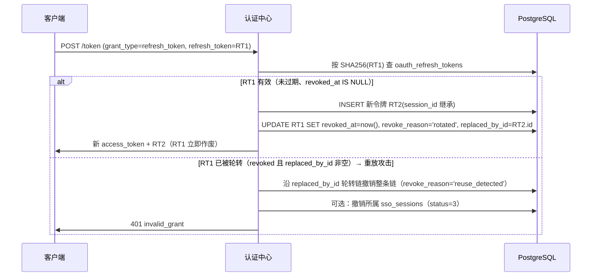
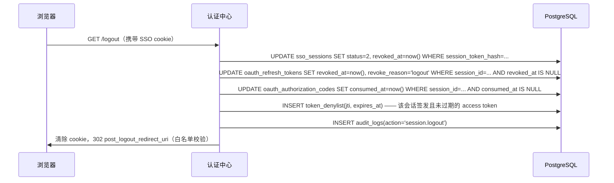

# 用户中心数据库设计文档（PostgreSQL）

> 目标数据库：PostgreSQL ≥ 14
> 交付物：[db/schema.sql](../db/schema.sql)（DDL）、[db/seed.sql](../db/seed.sql)（初始化数据）、本文档。
> 本期仅交付数据库设计，不包含 EF Core 实体/迁移与 API 实现。

## 1. 总体架构：四个域

统一方案以 **OAuth 2.0 / OIDC 标准数据模型**为骨架（授权码 + PKCE + Refresh Token 轮转 + Consent + JWK 密钥管理），共 **17 张表**，按职责划分为四个域：

| 域 | 表 | 职责 |
|---|---|---|
| **账号域（Passport）** | users、user_identities、password_histories、verification_codes、mfa_credentials | 全局唯一账号身份：用户主档、第三方联合登录绑定、密码历史、验证码、多因素认证凭证。用户在用户中心全局只注册一次。 |
| **业务线域** | business_lines、user_business_lines、oauth_clients、scopes | 多业务线接入：业务线（租户维度）定义、用户按业务线开通、业务线下的 OAuth 客户端（应用实例）、scope 字典。 |
| **SSO / OAuth2 / OIDC 域** | sso_sessions、oauth_authorization_codes、oauth_refresh_tokens、user_consents、token_denylist、signing_keys | 协议核心：认证中心全局会话（SSO cookie）、授权码（PKCE）、刷新令牌轮转、用户授权同意、JWT 撤销名单、JWK 签名密钥轮换。 |
| **安全审计域** | login_logs、audit_logs | 登录日志与关键操作审计，按 `created_at` 月度 RANGE 分区，只用逻辑外键。 |

### 全局设计规范

- **命名**：snake_case，不使用带引号的大小写标识符；表名复数。
- **主键**：业务主表 `bigint GENERATED ALWAYS AS IDENTITY`；`users` 额外提供 `public_id uuid`（对外的全局 Passport ID，不暴露自增 ID）；`sso_sessions` 用 uuid 主键。
- **时间**：一律 `timestamptz DEFAULT now()`。
- **软删除**：`deleted_at timestamptz`，唯一索引一律用 `WHERE deleted_at IS NULL` 的部分唯一索引，解决注销后手机号/邮箱复用问题。
- **令牌安全**：授权码、refresh token、会话令牌一律只存 SHA-256 哈希（`*_hash` 列），不存明文；access token 为 JWT 无状态签发、不入库，撤销走 `token_denylist`。
- **密码**：`password_algo`（argon2id/bcrypt）+ `password_params jsonb`，支持算法惰性升级。
- **外键策略**：事务性表保留物理外键；`login_logs`、`audit_logs` 两张大日志表只用逻辑外键（无约束）。

## 2. ER 关系图

```mermaid
erDiagram
    users ||--o{ user_identities : "绑定第三方账号"
    users ||--o{ password_histories : "密码历史"
    users ||--o{ mfa_credentials : "MFA 凭证"
    users ||--o{ user_business_lines : "开通业务线"
    business_lines ||--o{ user_business_lines : "被开通"
    business_lines ||--o{ oauth_clients : "挂载客户端"
    users ||--o{ sso_sessions : "全局登录会话"
    users ||--o{ oauth_authorization_codes : "签发授权码"
    users ||--o{ oauth_refresh_tokens : "签发刷新令牌"
    users ||--o{ user_consents : "授权同意"
    oauth_clients ||--o{ oauth_authorization_codes : "面向客户端"
    oauth_clients ||--o{ oauth_refresh_tokens : "面向客户端"
    oauth_clients ||--o{ user_consents : "被授权"
    sso_sessions ||--o{ oauth_authorization_codes : "会话级联"
    sso_sessions ||--o{ oauth_refresh_tokens : "会话级联"
    oauth_refresh_tokens ||--o| oauth_refresh_tokens : "轮转链 replaced_by_id (逻辑)"
    users ||--o{ login_logs : "逻辑外键"
    users ||--o{ audit_logs : "逻辑外键(operator)"
    users ||--o{ token_denylist : "逻辑关联"

    users {
        bigint id PK
        uuid public_id UK
        varchar username "部分唯一"
        varchar email "部分唯一"
        varchar phone "部分唯一"
        varchar password_hash "可空"
        smallint status "1正常2锁定3注销"
        timestamptz deleted_at "软删除"
    }
    user_identities {
        bigint id PK
        bigint user_id FK
        varchar provider
        varchar provider_user_id
        varchar union_id
    }
    password_histories {
        bigint id PK
        bigint user_id FK
        varchar password_hash
    }
    verification_codes {
        bigint id PK
        varchar identifier
        varchar scene
        varchar code_hash
        timestamptz expires_at
    }
    mfa_credentials {
        bigint id PK
        bigint user_id FK
        varchar mfa_type
    }
    business_lines {
        bigint id PK
        varchar code UK
        jsonb settings
    }
    user_business_lines {
        bigint id PK
        bigint user_id FK
        bigint business_line_id FK
        jsonb extra
    }
    oauth_clients {
        bigint id PK
        varchar client_id UK
        varchar client_secret_hash
        bigint business_line_id FK
        boolean require_pkce
    }
    scopes {
        bigint id PK
        varchar name UK
        varchar type "identity或resource"
    }
    sso_sessions {
        uuid id PK
        bigint user_id FK
        varchar session_token_hash UK
        smallint status "1活跃2登出3被踢"
    }
    oauth_authorization_codes {
        bigint id PK
        varchar code_hash UK
        bigint client_ref_id FK
        bigint user_id FK
        uuid session_id FK
        varchar code_challenge "PKCE"
    }
    oauth_refresh_tokens {
        bigint id PK
        varchar token_hash UK
        bigint user_id FK
        bigint client_ref_id FK
        uuid session_id FK
        bigint replaced_by_id "轮转链(逻辑)"
    }
    user_consents {
        bigint id PK
        bigint user_id FK
        bigint client_ref_id FK
        text granted_scopes
    }
    token_denylist {
        bigint id PK
        varchar jti UK
        timestamptz expires_at
    }
    signing_keys {
        bigint id PK
        varchar kid UK
        jsonb public_jwk
        varchar status
    }
    login_logs {
        bigint id PK "PK(id,created_at) 分区"
        bigint user_id "逻辑FK可空"
        varchar login_identifier
        boolean success
        timestamptz created_at PK
    }
    audit_logs {
        bigint id PK "PK(id,created_at) 分区"
        bigint operator_user_id "逻辑FK可空"
        varchar action
        jsonb changes
        timestamptz created_at PK
    }
```



## 3. 各表说明

### 3.1 账号域（Passport）

#### users — 全局唯一账号主表

| 字段 | 类型 | 说明 |
|---|---|---|
| id | bigint IDENTITY PK | 内部自增主键，不对外暴露 |
| public_id | uuid NOT NULL UNIQUE | 对外全局 Passport ID，默认 `gen_random_uuid()` |
| username / email / phone | varchar，可空 | 均为部分唯一索引 `WHERE deleted_at IS NULL`，注销后可复用 |
| password_hash / password_algo / password_params / password_updated_at | 可空 | 允许纯第三方登录账号无密码；algo 支持 argon2id/bcrypt 惰性升级，params 存算法参数 |
| nickname / avatar_url / gender / birth_date | — | 基本资料；gender：0未知/1男/2女 |
| status | smallint | 1正常/2锁定/3注销 |
| email_verified / phone_verified / mfa_enabled | boolean | 验证与 MFA 开关 |
| extra | jsonb | 扩展字段 |
| last_login_at / created_at / updated_at / deleted_at | timestamptz | deleted_at 非空即软删除 |

#### user_identities — 第三方联合登录绑定

| 字段 | 说明 |
|---|---|
| user_id | FK → users.id |
| provider / provider_user_id | 第三方平台与其用户 ID，`UNIQUE(provider, provider_user_id)` |
| union_id | 跨应用统一 ID（如微信 unionid），有索引 |
| provider_data | 第三方原始资料快照（jsonb） |

#### password_histories — 密码历史防重用

| 字段 | 说明 |
|---|---|
| user_id / password_hash / password_algo | 历史密码记录 |
| 索引 | `(user_id, created_at DESC)`；应用层保留最近 5 条 |

#### verification_codes — 短信/邮件验证码

备用持久化方案，**生产环境建议放 Redis**（见 §6.4）。

| 字段 | 说明 |
|---|---|
| identifier / scene | 手机/邮箱 + 场景（register/login/reset_password/bind，CHECK 约束） |
| code_hash | 验证码哈希，不存明文 |
| send_ip / expires_at / consumed_at | 来源 IP、过期时间、一次性消费标记 |
| attempt_count | 当前验证码已尝试校验次数（防暴力猜测） |
| last_attempt_at | 最近一次校验时间 |
| locked_until | 锁定到期时间，超过尝试上限后锁定至该时刻 |
| 索引 | `(identifier, scene, created_at DESC)`、`(expires_at)`（TTL 清理） |

防暴力猜测的两种实现路径：

- **有 Redis**：以 Redis 计数器（`vc:attempt:{scene}:{identifier}` + TTL）为主做尝试限流与锁定，本表三列仅作审计留痕；
- **无 Redis**：直接以本表 `attempt_count`/`locked_until` 做限流：每次校验失败 `attempt_count + 1` 并更新 `last_attempt_at`，超过上限（如 5 次）写入 `locked_until`，锁定期内直接拒绝校验。

#### mfa_credentials — 多因素认证凭证（预留）

| 字段 | 说明 |
|---|---|
| mfa_type | totp/webauthn/sms（CHECK 约束） |
| secret_encrypted | TOTP 密钥（应用层加密） |
| webauthn_credential_id / webauthn_public_key | WebAuthn 凭证 |
| backup_codes_hash | text[] 备用恢复码哈希 |
| verified_at / is_active | 绑定验证时间与启用状态 |

### 3.2 业务线域

#### business_lines — 业务线定义（租户维度）

| 字段 | 说明 |
|---|---|
| code | 唯一编码，如 mall/community |
| settings | jsonb 策略：会话超时、是否强制 MFA 等 |
| status | 1启用/2停用 |

#### user_business_lines — 用户与业务线开通关系

用户全局注册一次，按业务线开通。`UNIQUE(user_id, business_line_id)`；`extra jsonb` 为业务线侧扩展资料（也是未来 RBAC 的扩展锚点）。

#### oauth_clients — 接入应用（一个业务线可有多个客户端）

| 字段 | 说明 |
|---|---|
| client_id | 对外客户端标识，UNIQUE |
| client_secret_hash | bcrypt 哈希，不存明文；public 客户端可空 |
| business_line_id | FK → business_lines.id |
| client_type | confidential/public |
| redirect_uris / post_logout_redirect_uris | text[] 白名单 |
| allowed_grant_types / allowed_scopes | text[] |
| require_pkce | 默认 true，强制 PKCE |
| require_consent | 默认 false，自有业务线免 consent |
| access_token_ttl / refresh_token_ttl | 秒，默认 3600 / 2592000 |

#### scopes — Scope 字典

供管理后台与 OIDC Discovery：`name` 唯一，`type` 为 identity（openid/profile/email/phone/offline_access）或 resource（如 user.read），`show_in_discovery` 控制是否公开。

### 3.3 SSO / OAuth2 / OIDC 域

#### sso_sessions — 认证中心全局登录会话（SSO 核心）

浏览器 SSO cookie 对应的服务端会话，也是单点登出级联撤销的根节点。

| 字段 | 说明 |
|---|---|
| id | uuid PK，供下游令牌表 session_id 关联 |
| session_token_hash | SHA-256 哈希，UNIQUE |
| login_method / ip / user_agent / device_info | 登录上下文 |
| status | 1活跃/2登出/3被踢 |
| last_activity_at / expires_at / revoked_at | 滑动续期与撤销 |
| 部分索引 | `(user_id) WHERE status=1`、`(expires_at) WHERE status=1` |

#### oauth_authorization_codes — 授权码（10 分钟有效、一次性）

| 字段 | 说明 |
|---|---|
| code_hash | SHA-256 哈希，UNIQUE |
| client_ref_id / user_id / session_id | FK → oauth_clients.id / users.id / sso_sessions.id |
| redirect_uri / scope | 兑换时校验一致性 |
| code_challenge / code_challenge_method | PKCE（S256/plain，CHECK 约束，RFC 7636） |
| nonce | OIDC，回填 id_token 防重放 |
| expires_at / consumed_at | 一次性消费 |
| 部分索引 | `(expires_at) WHERE consumed_at IS NULL` |

#### oauth_refresh_tokens — 刷新令牌（一次性轮转）

| 字段 | 说明 |
|---|---|
| token_hash | SHA-256 哈希，UNIQUE |
| user_id / client_ref_id / session_id | session_id 支持按 SSO 会话级联撤销 → 单点登出 |
| expires_at / revoked_at / revoke_reason | 撤销原因：rotated/logout/reuse_detected 等 |
| replaced_by_id | 轮转链（自引用**逻辑**关联，不加物理 FK），用于重放攻击检测 |
| 索引 | `(user_id, client_ref_id)`、`(session_id)`、`(expires_at)`（TTL 清理） |

#### user_consents — 用户授权记录

`UNIQUE(user_id, client_ref_id)`，记录用户已同意的 scope（granted_scopes）、授权/过期/撤销时间。

#### token_denylist — JWT access token 撤销名单

access token 不入库，撤销以 `jti` 维度记入本表并配合 Redis 缓存查询；`expires_at`（原 token 过期时间）之后记录可清理。

#### signing_keys — JWK 签名密钥轮换

| 字段 | 说明 |
|---|---|
| kid | JWK key id，UNIQUE，写入 JWT header |
| algorithm / use | RS256/ES256（CHECK）、sig |
| public_jwk | jsonb，直接拼入 jwks_uri 响应 |
| private_key_encrypted | 私钥密文（应用层 KMS/信封加密） |
| status | active（签发中）/retired（仅验签）/revoked（吊销） |

### 3.4 安全审计域（月度分区、逻辑外键）

两张表均按 `created_at` 月度 RANGE 分区，主键 `(id, created_at)`（分区表主键必须包含分区键）；对 users 等只用**逻辑外键**（不加 REFERENCES），避免高频写入的约束开销并便于分区维护。

#### login_logs — 登录/认证日志

| 字段 | 说明 |
|---|---|
| user_id | 逻辑 FK，可空——记录登录失败尝试 |
| login_identifier | 登录输入的标识，防撞库统计 |
| business_line_id / client_ref_id / login_method | 登录上下文（逻辑 FK） |
| ip / user_agent / device_fingerprint | 设备信息 |
| success / failure_reason | 结果 |
| 索引 | `(user_id, created_at DESC)`、`(login_identifier, created_at DESC)`、`(ip, created_at DESC)` |

#### audit_logs — 关键操作审计

密码修改、绑定变更、授权撤销、客户端管理等。

| 字段 | 说明 |
|---|---|
| operator_user_id | 逻辑 FK，可空=系统操作 |
| action / resource_type / resource_id | 动作与资源定位（resource_id 为 varchar，兼容 uuid/bigint） |
| changes | jsonb 前后值 |
| ip / request_id | 来源与链路追踪 |
| 索引 | `(operator_user_id, created_at DESC)`、`(resource_type, resource_id)` |

#### 分区管理

`schema.sql` 提供 `ensure_monthly_partition(p_table text, p_month date)` 函数（plpgsql，动态创建 `<table>_YYYYMM` 分区，存在则跳过），并在建库时预建两张日志表自当前月起共 3 个月的分区。生产环境建议用 pg_cron 或应用定时任务每月提前调用创建下月分区。

**分区缺失的错误形态与兜底**：若忘记调用 `ensure_monthly_partition()`，在无兜底分区时新月份的写入会直接报错：`ERROR: no partition of relation "login_logs" found for row`。为此 schema.sql 为两张日志表各创建了 DEFAULT 兜底分区（`login_logs_default` / `audit_logs_default`）：分区任务中断时写入落入 DEFAULT 分区而不影响业务；恢复后应将 DEFAULT 分区中的数据**离线迁移**回对应月分区（先建好目标月分区→从 DEFAULT 分区 `DELETE ... RETURNING` 或导出后回插→注意：DEFAULT 分区中存在目标月份数据时，直接 `CREATE TABLE ... PARTITION OF ... FOR VALUES` 会因重叠校验失败，需先清空对应月份数据）。

**工程建议**：日志写入应与主业务事务解耦（异步队列/后台任务），即使日志写入异常也不阻断登录等主流程；并对“DEFAULT 分区出现数据”接入监控告警（如定时检查 `SELECT count(*) FROM login_logs_default`），以便及时发现分区任务失效。

## 4. 关键设计决策与理由

### 4.1 已定决策

1. **业务线 ≠ 客户端**：`business_lines`（租户维度）与 `oauth_clients`（应用实例）分离，一个业务线可挂 Web/App 多个客户端；用户与业务线的开通关系单独建 `user_business_lines`。避免"客户端即租户"造成的多端账号割裂。
2. **Access token 无状态 JWT + denylist 撤销**：不建 access_tokens 表，消除最高频的令牌写入；撤销通过 `token_denylist`（jti）+ Redis 缓存实现，denylist 只在主动撤销时写入，量级极小。
3. **单点登出链路**：`sso_sessions` ← `oauth_authorization_codes.session_id` / `oauth_refresh_tokens.session_id`。撤销一条 SSO 会话，即可按 session_id 级联失效所有下游授权码与刷新令牌，再把未过期 access token 的 jti 写入 denylist，完成全链路登出。
4. **凭证不设统一 EAV 表**：密码在 users、第三方绑定在 user_identities、MFA 在 mfa_credentials，各表字段语义明确。否决"user_credentials 万能凭证表"——验证码与密码混存有安全隐患，且 EAV 使约束与索引无法精确表达。
5. **RBAC 不在本期范围**：用户中心只管"身份 + 业务线开通 + scope 授权"，业务内细粒度角色权限由各业务线自管；`user_business_lines.extra` 预留扩展（见 §6.1）。

### 4.2 被否决的替代方案

| 替代方案 | 否决理由 |
|---|---|
| 复用 IdentityServer/Duende 或 OpenIddict 全套表结构 | 依赖重、vendor lock-in、与多业务线定制模型冲突；本方案自建但字段完全对齐 RFC 6749 / RFC 7636 / OIDC Core |
| ASP.NET Core Identity 原生 PascalCase 表 | PostgreSQL 下带引号大小写标识符使用体验差，且 AspNetUsers 模型对 passport 多业务线场景冗余 |
| shard_key 预留分库字段 | 单库阶段属过度设计；改为文档中说明按 `user_id` 哈希分库的演进路径（§6.2） |
| 数据库内 gen_ulid() 生成 ID | PostgreSQL 无原生函数、依赖第三方扩展；改为 `IDENTITY` 自增 + `public_id uuid` 对外 |
| 令牌明文入库 | 泄库即失守；统一改为 SHA-256 哈希存储，验证时对提交值哈希后比对 |

## 5. 典型流程

### 5.1 SSO 授权码登录（含 PKCE）

```mermaid
sequenceDiagram
    participant B as 浏览器
    participant C as 业务线客户端(mall-web)
    participant A as 认证中心
    participant DB as PostgreSQL

    B->>C: 访问受保护页面
    C->>B: 302 /authorize?client_id&redirect_uri&scope&state<br/>&code_challenge&code_challenge_method=S256&nonce
    B->>A: GET /authorize
    A->>DB: 校验 oauth_clients（redirect_uri 白名单、allowed_scopes、require_pkce）
    alt 无有效 SSO 会话
        A->>B: 跳转登录页
        B->>A: 提交凭证（密码/验证码/第三方）
        A->>DB: 校验 users（含 password_algo 惰性升级）; INSERT sso_sessions(session_token_hash); INSERT login_logs
        A->>B: Set-Cookie: sso_session（明文仅下发，一次入库即哈希）
    else 已有活跃会话
        A->>DB: 按 session_token_hash 命中 sso_sessions(status=1)
    end
    opt require_consent = true 且无有效 user_consents
        A->>B: 展示授权同意页
        B->>A: 同意
        A->>DB: UPSERT user_consents
    end
    A->>DB: INSERT oauth_authorization_codes(code_hash, session_id, code_challenge, nonce, expires_at=+10min)
    A->>B: 302 redirect_uri?code=xxx&state=yyy
    B->>C: 携带 code 回调
    C->>A: POST /token (code, code_verifier, client_id, client_secret)
    A->>DB: 按 code_hash 查授权码：未过期、consumed_at IS NULL、redirect_uri 一致
    A->>A: 校验 PKCE: BASE64URL(SHA256(code_verifier)) == code_challenge
    A->>DB: UPDATE consumed_at=now(); INSERT oauth_refresh_tokens(token_hash, session_id)
    A->>C: access_token(JWT, kid←signing_keys) + id_token(含 nonce) + refresh_token
```

### 5.2 Refresh Token 轮转（rotation + 重放检测）



### 5.3 单点登出（级联撤销）



要点：`session_id` 是级联撤销的枢纽——一次 UPDATE 即可失效该会话名下全部刷新令牌；无状态 access token 通过 denylist 补偿撤销，等其自然过期后 denylist 记录即可清理。

## 6. 演进路线

### 6.1 RBAC 扩展

本期用户中心只管"身份 + 业务线开通 + scope 授权"。未来若需集中式角色权限，可新增：

- `roles(id, business_line_id FK, code, name)`、`permissions(id, business_line_id FK, code, name)`、`role_permissions`、`user_roles(user_id, role_id)` —— 全部按 `business_line_id` 隔离，互不越权；
- 过渡期可先用 `user_business_lines.extra` 存轻量角色标签，无需改表。

### 6.2 分库分表预案

初期用户量单库可承载（千万级以下），不预埋 shard_key。达到瓶颈时的演进路径：

1. **垂直拆分**：先把安全审计域（login_logs/audit_logs）迁出到独立日志库；
2. **读写分离**：users/sso_sessions 读多写少，加只读副本；
3. **水平分库**：按 `user_id` 哈希分库，users 及其强关联表（user_identities、user_business_lines、oauth_refresh_tokens 等）同键路由；`public_id → user_id` 的映射可由网关层缓存承担；届时物理外键降级为逻辑外键。

### 6.3 日志归档策略

- 月度分区天然支持按分区归档：超过保留期（建议 login_logs 6~12 个月、audit_logs 依合规要求 1~3 年）的分区，先 `DETACH PARTITION` 再导出至冷存储（S3/OSS + parquet），最后 DROP；
- `ensure_monthly_partition()` 由 pg_cron 或应用调度每月提前创建下月分区；
- 归档操作本身写入 audit_logs 留痕。

### 6.4 验证码迁移 Redis

`verification_codes` 表是无 Redis 场景的备用持久化。生产环境建议迁移至 Redis：

- key：`vc:{scene}:{identifier}`，value 为 code 哈希，TTL 即过期时间，天然自动清理；
- 发送频控（60s/次、日上限）用 Redis 计数器实现；
- 迁移后本表可仅保留用于合规审计的发送记录（不含 code_hash），或直接停用。

## 7. EF Core / Npgsql 映射约定

后续若按本 schema 生成 EF Core 模型，统一遵循以下约定：

| 数据库特性 | EF Core / Npgsql 映射 |
|---|---|
| `bigint GENERATED ALWAYS AS IDENTITY` 主键 | `ValueGeneratedOnAdd()`（或 `UseIdentityAlwaysColumn()`）；**禁止应用层手动赋值 ID**——GENERATED ALWAYS 下显式插入 ID 会直接报错 |
| `jsonb` 列（extra/settings/changes 等） | 统一映射策略二选一：`JsonDocument`（灵活、需注意 Dispose）或 POCO + System.Text.Json（强类型，Npgsql 动态 JSON 映射）；全库保持一致，不混用 |
| `text[]` 数组（redirect_uris/allowed_scopes/backup_codes_hash 等） | 统一映射为 `string[]`（Npgsql 原生支持，无需值转换器） |
| 分区表复合主键（login_logs/audit_logs） | `HasKey(x => new { x.Id, x.CreatedAt })`；建议 EF 侧只读（查询/报表），写入路径单独封装（Dapper/原生 SQL + 异步队列），避免 EF 变更追踪与分区写入路径耦合 |
| `timestamptz` | 映射 `DateTimeOffset` 或 UTC `DateTime`（Npgsql 6+ 默认 UTC 语义），全库统一 |
| `inet` / `uuid` | `System.Net.IPAddress` / `Guid`（Npgsql 原生支持） |
