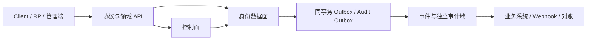
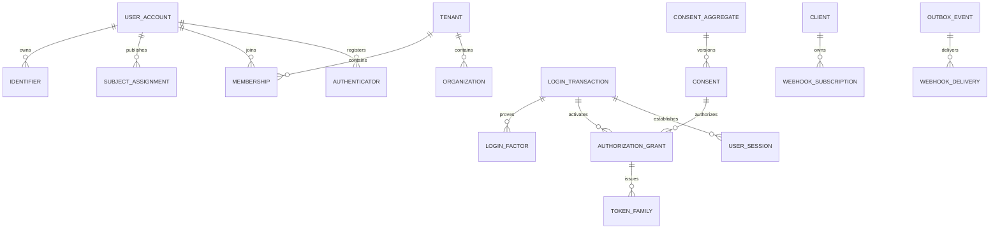

# 统一身份与访问平台 PostgreSQL 数据库构建文档

> 文档版本：v2.2
>
> 设计来源：`docs/能力地图.md` v1.1、`docs/统一身份与访问平台建设与验收蓝图.md` v1.1
>
> 技术基线：.NET 10、SqlSugar、PostgreSQL 16+
>
> 设计原则：从能力与规范重新建模，不兼容、不继承旧实现表结构

## 1. 交付范围

本基线包含 18 个业务 Schema、145 张基表、2 个视图、11 个默认迁移版本，以及完整的表注释和语义化列注释生成/验收机制。

交付文件：

| 顺序 | 文件 | 内容 |
|---|---|---|
| 1 | `migrations/000_bootstrap.sql` | `pgcrypto`、18 个 Schema、公共触发器函数、迁移台账、公开 ID 台账 |
| 2 | `migrations/010_core_identity.sql` | Operation、幂等、Global User、pairwise Subject、Identifier、合并与注销 |
| 3 | `migrations/020_authentication_oauth.sql` | 认证器、Login Transaction、Challenge、Client、Grant、Session、Token、撤销与退出 |
| 4 | `migrations/030_organization_authorization_profile.sql` | 业务线、租户、组织、Membership、Invitation、RBAC/PDP 与 Profile |
| 5 | `migrations/040_privacy_federation.sql` | Consent、个人权利、保留/导出、OIDC/SAML/SCIM 联合与目录同步 |
| 6 | `migrations/050_control_risk_workload_assurance_crypto.sql` | 审批、配置发布、风险、委托、机器身份、密钥和证书 |
| 7 | `migrations/060_integration_audit_messaging.sql` | Event Schema、Outbox、Webhook、审计、消息与可达性 |
| 8 | `migrations/070_migration_catalog_comments.sql` | 旧系统迁移、双轨权威、反向 CDC、对账、列注释与数据字典 |
| 9 | `migrations/075_integrity_hardening.sql` | 审批绑定、上下文一致性、租户外键、不可变证据、组织/角色守卫和全部外键前导索引 |
| 10 | `migrations/080_roles_permissions.sql` | 统一 NOLOGIN owner、显式表/列最小权限和职责分离角色 |
| 11 | `migrations/900_seed.sql` | 平台范围租户、安全 Profile、时长、分类、错误、义务、权限及 218 条需求追踪种子 |
| 入口 | `build.sql` | `psql` 一键按序执行默认迁移并运行验收 |
| 验收 | `verify.sql` | 结构、注释、状态、主键、公开 ID、敏感列和关键索引/触发器检查 |
| 可选 | `optional/910_rls_optional.sql` | PostgreSQL RLS 租户隔离；必须完成连接池上下文测试后启用 |
| 演练 | `rollback/999_rollback_all.sql` | 仅空环境/演练环境使用的全量破坏性回滚，默认拒绝执行 |

## 2. 设计边界

数据库只保存身份平台权威数据和跨域契约，不保存订单、资产、积分、业务标签等业务事实。业务系统不得直写本数据库，只能通过协议、API、事件或受控迁移入口访问。



核心边界：

- 手机号、邮箱、外部 ID 不是内部主键。
- `id uuid` 是内部关系键；`public_id` 是永久占用、不可复用的公开标识。
- Global User、Tenant、Membership、Client、Grant、Session、Consent、Device 等状态分别建模，不使用一个通用 `status` 混合语义。
- 用户、租户、Client、机器主体和 Consent 使用独立 security epoch/watermark。
- 权威写入与领域事件同事务提交到 Outbox；跨域流程使用 Operation/Saga，不做跨库双写。

## 3. Schema 与表目录

| Schema | 表数 | 基表 |
|---|---:|---|
| `assurance` | 4 | `assurance_policy`、`identity_assurance_assertion`、`recovery_request`、`delegation` |
| `audit` | 4 | `audit_outbox`、`audit_event`、`audit_seal`、`data_access_event` |
| `authn` | 9 | `authenticator`、`password_credential`、`password_history`、`recovery_code_batch`、`recovery_code`、`login_transaction`、`login_factor`、`verification_challenge`、`device_authorization` |
| `authz` | 12 | `permission`、`role`、`role_permission`、`role_exclusion`、`role_assignment`、`policy_release`、`obligation_type`、`pep_capability`、`authorization_decision`、`relationship_tuple`、`access_review`、`permission_simulation` |
| `control` | 7 | `approval_case`、`approval_decision`、`config_release`、`security_exception`、`break_glass_grant`、`owner_review`、`client_certification_run` |
| `core` | 10 | `schema_migration`、`public_id_ledger`、`security_profile`、`duration_policy`、`data_classification`、`error_registry`、`requirement_trace`、`async_operation`、`async_operation_step`、`idempotency_request` |
| `crypto` | 3 | `key_asset`、`certificate_asset`、`jwks_release` |
| `federation` | 9 | `identity_provider`、`identity_provider_key`、`external_identity`、`attribute_mapping`、`directory_connection`、`directory_object`、`directory_sync_run`、`assertion_replay`、`federation_migration` |
| `iam` | 7 | `user_account`、`subject_assignment`、`identifier`、`identifier_tombstone`、`account_merge`、`account_merge_item`、`account_deletion` |
| `integration` | 6 | `event_schema`、`outbox_event`、`webhook_subscription`、`webhook_delivery`、`consumer_watermark`、`event_replay_request` |
| `messaging` | 8 | `provider`、`route_policy`、`message_template`、`message_send`、`delivery_receipt`、`reachability`、`content_compliance_rule`、`provider_metric` |
| `migration` | 7 | `migration_batch`、`authority_lease`、`legacy_id_mapping`、`duplicate_candidate`、`change_log`、`reconciliation_run`、`rollback_execution` |
| `oauth` | 16 | `application`、`client`、`client_uri`、`client_credential`、`api_resource`、`scope_definition`、`device`、`authorization_grant`、`user_session`、`token_family`、`refresh_token`、`authorization_code`、`reference_access_token`、`revocation_record`、`logout_request`、`logout_target_result` |
| `org` | 9 | `business_line`、`tenant`、`tenant_domain`、`organization`、`membership`、`invitation`、`user_group`、`group_member`、`usage_meter` |
| `privacy` | 17 | `purpose`、`data_category`、`purpose_data_mapping`、`agreement`、`agreement_acceptance`、`consent_aggregate`、`consent`、`marketing_subscription`、`privacy_request`、`privacy_request_task`、`legal_hold`、`export_job`、`retention_rule`、`deletion_proof`、`cross_border_authorization`、`minor_protection`、`privacy_impact_assessment` |
| `profile` | 7 | `field_definition`、`user_profile`、`sensitive_attribute`、`business_profile`、`profile_change`、`user_preference`、`notification_preference` |
| `risk` | 5 | `risk_policy_release`、`risk_signal`、`risk_assessment`、`security_case`、`denylist_entry` |
| `workload` | 5 | `machine_principal`、`machine_credential`、`trust_bundle`、`workload_attestation`、`token_exchange` |

完整字段、约束和描述以 SQL 中的 `COMMENT ON TABLE`、迁移生成的语义化 `COMMENT ON COLUMN` 及 `core.data_dictionary` 为准。重要安全列使用专用描述，其他列使用表描述、类型和治理规则生成非空说明；`verify.sql` 会拒绝空注释和旧版占位说明：

```sql
SELECT *
FROM core.data_dictionary
ORDER BY schema_name, table_name, ordinal_position;
```

## 4. 核心关系



## 5. 关键不变量的数据库落点

| 不变量 | 数据库落点 |
|---|---|
| UID、Subject、Membership 等公开 ID 不复用 | `core.public_id_ledger` + 所有 `public_id` 插入触发器 |
| 同一作用域最多一个有效 Identifier | 不随检索密钥轮换变化的 `ownership_digest` + `ux_identifier_verified_scope` 部分唯一索引 |
| Identifier 不存手机号/邮箱明文 | 随机化密文、可轮换检索盲索引、独立所有权摘要、密钥版本和永久 tombstone |
| 已匿名化、删除、合并主体不可恢复 | `lifecycle_state` CHECK + 终态触发器 |
| 冻结主体不得创建 Session/登记有效认证器 | `authn.fn_assert_user_can_authenticate`、Session/Authenticator 守卫 |
| Login Transaction 未完成或上下文不一致不得签发 | Session、Grant、Authorization Code、Token Family、Reference Token 守卫精确绑定 User/Machine、Client、Tenant、scope/resource、Session 和 epoch |
| Session 不得伪造初态、原因或终态时间 | Session 强制从 ACTIVE 创建，只能单向过期、失陷或撤销；原因与时间由数据库生成并冻结 |
| Refresh Token 不得改写、跨 Family 串代或复用 | Family 行锁分配连续 generation、延迟 successor 约束、CURRENT 单向状态机；重放函数原子失陷 Family 并追加撤销记录 |
| PENDING/DENIED/过期 Consent 不构成依据 | Consent 聚合用途/接收方/类别摘要与用途映射校验；Grant、Token、订阅、偏好和 Webhook 使用当前 epoch |
| Consent 仅影响精确用途/类别/接收方聚合 | `consent_aggregate.aggregate_key_hash` + 独立单调 epoch |
| 新 Consent 请求不得提前失效既有同意 | `consent_version` + 单一 PENDING/GRANTED 部分唯一索引；PENDING 不推进 epoch，决定生效时才原子替代旧 GRANTED |
| 业务封禁不改变全局用户 | `org.membership.membership_state` 独立于 `iam.user_account` |
| 跨租户范围一致 | 所有直接 `tenant_id` 自动外键、Client/Grant/Session 复合外键、组织/用户组/角色守卫，以及直接与派生表可选 RLS |
| Client/机器主体受损不得原地恢复 | Client/Machine 自定义状态守卫 |
| 发起人不得自审，批准只能执行一次且不能换资源/租户 | Approval 强制从 DRAFT 创建；提交、批准、拒绝、执行、取消和过期时间由数据库记录；审核后请求全字段不可变；Tenant、资源类型、引用、内容摘要和唯一 `execution_id` 精确绑定 |
| Release 审批不得阻断发布或在激活后被替换 | Config/授权策略/风险策略可在激活前写入已执行审批绑定，进入 ACTIVE 后冻结；STAGED/ACTIVE/DEPRECATED/REVOKED 时间由数据库生成 |
| 风险历史不可改写 | `risk_signal`、`risk_assessment` 追加型触发器 |
| Outbox/投递正文不可修改 | Outbox、Webhook Delivery、Message Send 的单向投递状态机和列白名单；Webhook 每次尝试新增独立记录 |
| 审计防篡改 | Audit Outbox 单向状态机；数据库串行分配链序号/前序摘要并重算事件哈希；Audit Seal；禁止改删 |
| 双轨迁移不得双主写 | `authority_lease` 唯一活跃租约与 fencing token |
| 越过不可逆边界不得伪回滚 | Migration Batch/Operation 状态守卫 |

有些不变量无法仅靠关系数据库完整证明，例如授权是否扩权、SAML 签名验证、FIDO 证明、SSRF、密钥实际位于 HSM、跨系统删除是否完成。此类规则由数据库保存不可变输入、版本和证据，由服务、协议测试、对账和发布门禁共同完成。

## 6. 状态与并发规则

- 状态字段统一命名为具体含义的 `*_state`，并用 CHECK 固定取值。
- 终态由 `core.fn_terminal_state_guard` 或领域专用触发器保护。
- 不是所有失败都进入终态：Operation、Privacy Task、迁移和投递允许 `BLOCKED/PARTIAL/FAILED` 后受控继续。
- 业务聚合使用 `row_version bigint` 乐观锁；数据库触发器只负责兜底递增，应用必须在 `WHERE id = @id AND row_version = @expected` 中比较原版本。
- security epoch 由 `core.fn_forbid_epoch_decrease` 保证不回退；变更安全事实时必须在同一事务推进 epoch、写撤销记录和 Outbox/Audit Outbox。
- 时间一律使用 `timestamptz`；安全过期判断使用数据库 `clock_timestamp()`，应用传入时间只作为请求证据。

## 7. 敏感数据与密钥

- 密码只保存自适应/内存困难算法输出和参数；禁止通用 SHA/HMAC 直接作为密码哈希。
- 验证码、Device Code、授权码、Refresh Token、Client Secret 只保存不可逆摘要。
- 手机号、邮箱等需要等值检索的标识保存随机化密文 + HMAC 盲索引；密钥版本分离。
- 其余敏感 Profile 保存随机化密文，不提供模糊检索。
- 私钥不进入数据库；`crypto.key_asset`、Client/Machine Credential 只保存 KMS/HSM 引用、公钥、证书或摘要。
- 事件、日志和审计禁止保存密码、验证码、完整 Token、私钥；`verify.sql` 会扫描高风险明文字段名。

## 8. 数据库创建与迁移

建议数据库参数：UTF-8、UTC、生产连接强制 TLS；业务展示时再转换时区。

```sql
CREATE DATABASE k_user_center
    WITH ENCODING = 'UTF8'
         TEMPLATE = template0;

ALTER DATABASE k_user_center SET timezone = 'UTC';
ALTER DATABASE k_user_center SET statement_timeout = '30s';
ALTER DATABASE k_user_center SET idle_in_transaction_session_timeout = '60s';
```

默认使用带 advisory lock、断点续跑和验收的构建入口：

```powershell
psql --set ON_ERROR_STOP=1 `
  --dbname $env:KUC_DATABASE_URL `
  --file .\docs\database\build.sql
```

生产流水线计算每个文件的小写十六进制 SHA-256，并以 `--set kuc_sha_000=<hash>`、`--set kuc_sha_010=<hash>` … `--set kuc_sha_900=<hash>` 传给 `build.sql`。未传摘要时允许本地构建，但不能作为生产发布证据；已登记版本的描述或非空摘要发生漂移会立即失败。

执行约束：

1. `build.sql` 持有会话级迁移 advisory lock，并按迁移台账跳过已完成版本；任何失败立即停止。
2. 生产流水线必须传入每个脚本 SHA-256；同版本描述或内容漂移必须阻断。
3. 首次空库引导必须使用可创建角色并可向 `kuc_owner` 转移所有权的受控引导账户（通常为临时迁移管理员）；常规迁移登录角色必须属于 `kuc_migrator`。`080_roles_permissions.sql` 转移所有权后，`build.sql` 会自动 `SET ROLE kuc_owner` 再执行种子和验收，后续独立迁移也必须先显式切换角色。
4. 登录角色及密码/证书由基础设施管理，不写入仓库；应用登录角色不得成为 `kuc_owner`、`kuc_migrator` 或平台控制角色成员。
5. `910_rls_optional.sql` 不在默认迁移序列内。
6. `999_rollback_all.sql` 会删除全部平台 Schema，且必须显式设置保护开关；禁止用于已有生产数据的环境。

## 9. 权限模型

数据库定义以下 NOLOGIN 组角色：

| 角色 | 目的 |
|---|---|
| `kuc_owner` | 所有平台 Schema、表、视图和函数的统一 NOLOGIN owner；仅供迁移 `SET ROLE` |
| `kuc_migrator` | 执行迁移、注释和结构验收 |
| `kuc_app` | 用户、成员、Profile、隐私请求、关系元组及事务 Outbox；不能写控制面 |
| `kuc_authn_writer` | 认证、会话、Token、认证风险及联合登录运行态身份/重放记录写入 |
| `kuc_control_writer` | 控制面、策略、密钥、联合和隐私配置写入 |
| `kuc_outbox_dispatcher` | Outbox 状态列、Webhook 每次尝试和消费水位 |
| `kuc_message_dispatcher` | 消息发送状态列、回执、可达性和供应商指标 |
| `kuc_audit_writer` | Audit Outbox、独立审计和数据访问审计写入 |
| `kuc_auditor` | 审计、控制面和数据字典只读 |
| `kuc_readonly` | 运维只读；生产应再按环境收窄 |

应用运行账户不得拥有 Schema owner、DDL、`BYPASSRLS` 或直接删除权限。

## 10. 可选 RLS

RLS 是第二道隔离，不替代应用授权。启用前必须验证：

- 每个事务最先执行参数化 `SELECT set_config('app.tenant_id', '<trusted uuid>', true)`；不得拼接 SQL。
- 从连接池归还后设置不会泄漏到下一请求。
- 平台级记录的全零 UUID 只可由控制面/迁移角色访问。
- 后台任务按租户分片，或使用明确的受控平台角色。
- 910 同时覆盖直接 `tenant_id` 表，以及 Client、Grant、业务线 Resource/Scope、Consent/删除证明、IdP、Webhook、Message、机器凭证、认证报告和迁移批次等可确定唯一租户或业务线的派生表。
- Global User、Authenticator 等在登录前无法唯一确定租户的全局对象仍由应用授权负责，RLS 不替代其 Subject/Actor 校验。
- 所有 API、批量、搜索、导出、事件和审计查询都完成跨租户负向测试。

## 11. 索引、分区与容量

当前基线为逻辑完整模型，显式覆盖唯一性、活跃态、撤销、过期、重试、Subject、租户和审计时间查询。生产上线前根据压测确定：

- `075_integrity_hardening.sql` 会为每个外键补齐非部分前导 B-tree 索引；`verify.sql` 对全部外键逐一检查，后续迁移不得绕过。

- `audit.audit_event`、`audit.data_access_event`、`integration.outbox_event`、`integration.webhook_delivery`、`messaging.message_send`、`risk.risk_signal` 按月或按周原生分区。
- 分区必须保留全局幂等/唯一性能力；不能因分区键限制降低 `event_id`、`idempotency_key`、Token hash 等唯一语义。
- 大表历史分区转只读后再归档；审计和撤销记录不得早于法律、最大 Token TTL、回放和对账窗口清理。
- BRIN 用于大体量时间顺序数据，B-tree 用于等值、状态队列和唯一性。
- 自动清理必须识别 Legal Hold、Security Case 和 Privacy Request 阻断。

## 12. 备份、恢复与灾备

- C0/C1：Identifier、Credential、Authenticator、Grant、撤销和全部 security/consent epoch，目标 RPO=0。
- 常规 Profile 等 C2 数据目标 RPO≤5 分钟。
- 恢复后必须先执行 `verify.sql`、epoch 单调性对账、迁移 authority lease 对账和撤销水位对账，再开放写流量。
- 恢复不得复活已撤销/销毁密钥、旧密码、旧认证器、已撤销 Grant、Consent 或较低 epoch。
- 备份介质中的待删除 PII 按 `retention_rule` 与 `deletion_proof.backup_policy_evidence` 管理，不能宣称已从所有介质即时删除。

## 13. 验收

`verify.sql` 至少检查：

- 18 个 Schema、11 个默认迁移版本、145 张基表和关键表是否存在。
- 每张基表是否有主键、表描述和每列非空且非旧占位描述。
- 每个 `*_state` 是否有 CHECK 约束。
- 每张含 `public_id` 的业务表是否登记永久 ID 触发器。
- 每张含 `row_version` 的表是否有递增触发器。
- 疑似密码、Secret、完整 Token、私钥、手机号和邮箱明文字段。
- 所有直接租户外键、所有外键前导索引、关键部分唯一索引和状态/安全触发器。
- `kuc_owner` 对象所有权、PUBLIC 函数权限、普通应用控制面写权限、敏感表读取泄漏和投递角色列权限。
- 218 个 REQ/API/EVT/INV 标识的追踪种子、平台范围租户种子及安全加固列。
- 启用 910 后直接与关键派生租户表的 RLS/Policy 完整性。

本次交付按要求未连接 PostgreSQL 实例，只完成脚本引用、对象名、迁移登记、约束/触发器/权限覆盖和文档一致性的静态验证；上线前仍必须在 PostgreSQL 16+ 临时库执行 `build.sql` 与 `verify.sql`。

## 14. 阶段 0 必须实例化的配置

数据库结构已预留以下能力，但不会替项目擅自决定业务/合规结论：

- 运营地区、数据驻留、未成年人、实名/人脸和跨境处理范围。
- 等保与密评适用级别，SM2/SM3/SM4 和其他算法 allowlist。
- 邮箱 local-part 规范化例外、Identifier 唯一性 Profile 与隔离期。
- Profile 的实际 Access/Refresh/Session TTL、撤销 SLA 和风险失败策略。
- 租户所有权、审批人数、职责分离矩阵、Break-glass 范围。
- 数据分类、用途、接收方、保留期限和 Legal Hold 责任方。
- 表分区阈值、容量、归档、备份和跨区域拓扑。

这些值必须通过版本化配置、审批和种子增量迁移落地，禁止直接修改历史 Release 或审计证据。
