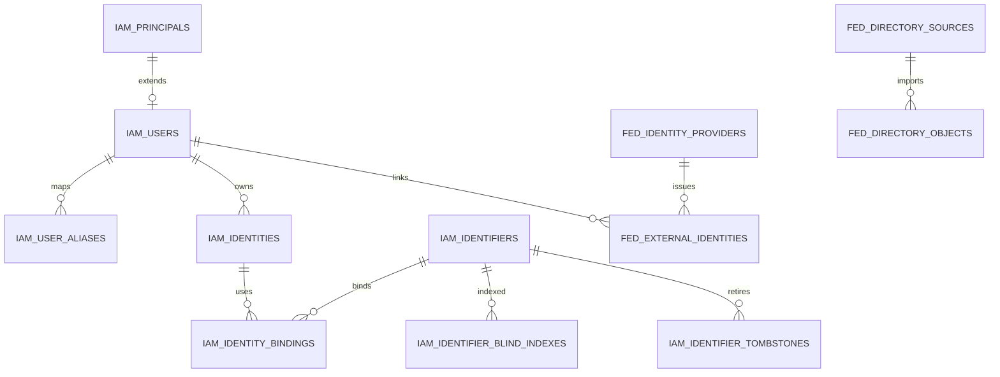
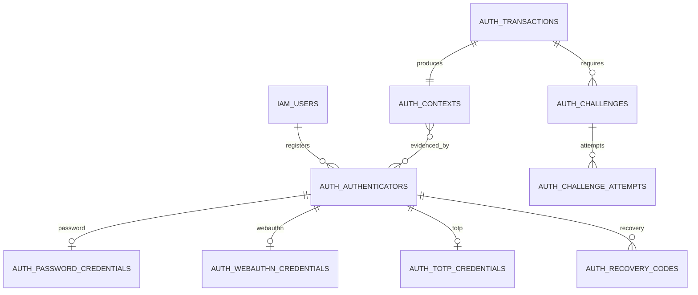
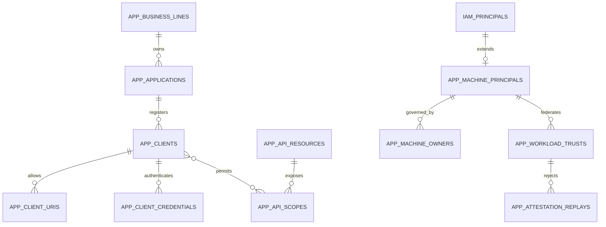
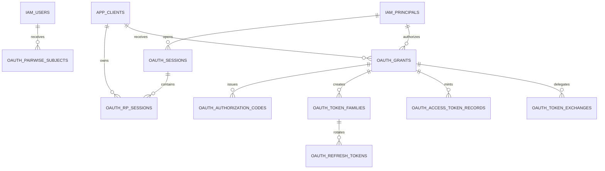
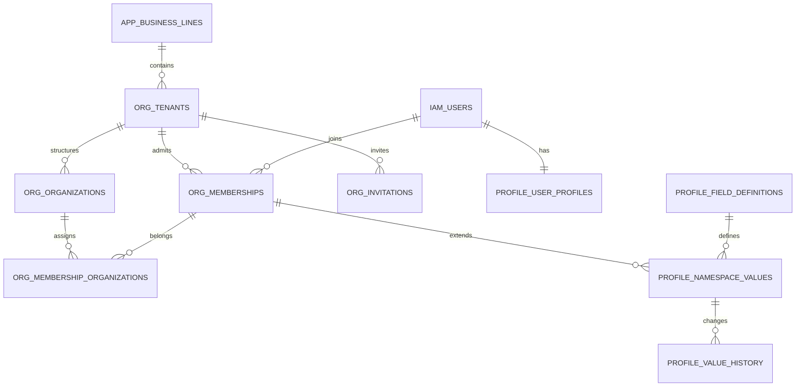
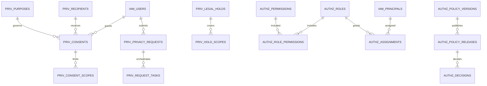
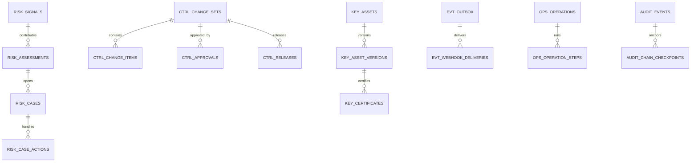

# 统一身份与访问平台 PostgreSQL 数据库模型设计

> 文档状态：目标态逻辑模型与物理实施基线
> 数据库基线：PostgreSQL 16+，单数据库，仅使用默认 `public` schema
> 实施方式：原生 PostgreSQL DDL，不使用 ORM
> 上游依据：[中心能力地图](./中心能力地图.md)、[统一身份与访问平台建设与验收蓝图](./统一身份与访问平台建设与验收蓝图.md)

## 1. 目标与边界

本文把能力地图与建设蓝图中的身份、认证、会话、授权、隐私、风控、控制面、事件、审计和运维对象落实为可实施的 PostgreSQL 关系模型，并规定表、约束、索引、事务函数、RLS、分区和保留边界。

数据库是平台权威状态的持久化组件，不是业务系统共享数据库。业务应用、脚本、管理后台和事件消费者只能通过平台协议、API 或事件接入，禁止直接写表。订单、资产、积分、会员等级、内容、CRM 标签等业务事实不进入本库。

本设计覆盖目标态，功能可以分阶段启用，但已启用领域不得删除相应的安全约束、审计和保留要求。

## 2. 固定设计决策

以下决策为 DDL 和应用实现的共同前提，不再作为实施阶段的可选项。

### 2.1 数据库拓扑与命名

- 仅一个 PostgreSQL 数据库，所有对象位于默认 `public` schema；不创建或依赖其他 schema。
- 单 schema 不是安全边界。使用数据库角色、表级权限、列级暴露视图、RLS、KMS/HSM 和外部不可变归档建立纵深防御。
- 表名使用领域前缀：
  - `iam_`：主体、用户与 Identifier。
  - `fed_`：外部身份源、联合身份与目录同步。
  - `auth_`：认证器、Challenge、认证事务与保证上下文。
  - `oauth_`：会话、Grant、授权码、Token 与撤销。
  - `app_`：业务线、应用、Client、API Resource 与机器身份。
  - `org_`：Tenant、Organization、Membership 与邀请。
  - `profile_`：公共和业务扩展资料。
  - `priv_`：Consent、协议、营销订阅、隐私请求与法律保留。
  - `authz_`：权限目录、角色、策略与决策证据。
  - `risk_`：风险信号、评估和案件。
  - `ctrl_`：控制面变更、审批和发布。
  - `key_`：密钥、证书与轮换证据。
  - `evt_`：Outbox、Inbox、Webhook 和安全信号。
  - `audit_`：追加审计。
  - `ops_`：异步 Operation、幂等和迁移映射。
- 列名使用 `snake_case`。内部主键统一为 `<object>_pk`，外部标识统一为 `<object>_id`，避免把内部行号暴露为 API 标识。

### 2.2 标识与主键

- 所有内部关系主键使用 `bigint GENERATED ALWAYS AS IDENTITY`。
- 所有对外不可推断标识使用随机 UUIDv4，数据库类型为 `uuid`，并建立 `UNIQUE NOT NULL`。包括 Global UID、pairwise Subject、Membership ID、Session ID、Grant ID、Client ID、Operation ID 等。
- 明确不使用 UUIDv7 作为用户或其他对外标识，因为 UUIDv7 内含时间信息，会暴露近似注册或创建时间。事件即使天然带时间，也统一使用 UUIDv4，降低实现分歧。
- UUIDv4 可由可信应用生成，或在 PostgreSQL 16+ 使用内置 `gen_random_uuid()` 作为默认值；跨系统导入时必须校验版本为 4。
- UID、pairwise Subject、Membership ID、旧 UID 映射和墓碑标识一经签发永久不复用。外部 API 可展示 `usr_`、`mbr_` 等前缀，但前缀不存入 UUID 列。
- 手机、邮箱、用户名、OIDC `sub`、SAML NameID 和旧系统 ID 都不得作为内部主键或跨域外键。

### 2.3 类型、时间与版本

- 状态、类型、协议和封闭集合使用 `text COLLATE "C" NOT NULL` 加显式 `CHECK`，不使用 PostgreSQL enum。增加状态值必须通过 DDL、状态机测试和兼容评审。
- 可配置目录项使用引用表和 FK；状态机值不能通过“向字典表插一行”动态扩展。
- 所有业务时间使用 `timestamptz`，写入和比较以 UTC 为准。会话连接执行 `SET TIME ZONE 'UTC'`，API 使用带 `Z` 或明确偏移的 RFC 3339。仅日历日期使用 `date`。
- 不使用无时区 `timestamp` 表示事实时间，不依赖数据库服务器本地时区。
- 可变聚合根包含 `row_version bigint NOT NULL DEFAULT 1 CHECK (row_version > 0)`；更新使用 `WHERE row_version = :expected` 并递增，映射 `If-Match/expected_version`。
- 产生领域事件的聚合另有 `aggregate_version bigint`。User、Client、Tenant 分别维护单调递增的 `security_epoch`；策略维护不可变 `policy_version`；撤销表维护 `revocation_watermark`。
- 金额不属于本平台；分数用受界限约束的 `numeric`，网络地址用 `inet`，摘要和密文用 `bytea`。

### 2.4 PII、凭证与密钥

手机号、邮箱、姓名、地址、外部账号值、设备可链接标识等 PII 不保存可直接检索的明文副本。

每个可检索 PII 值保存以下信息：

- `ciphertext bytea`：使用 AEAD 随机加密，每次加密使用随机 nonce；相同明文得到不同密文。
- `encryption_key_ref text`、`encryption_key_version integer`：引用 KMS/HSM 中的密钥，不在数据库保存数据加密密钥。
- `blind_index bytea`：对**规范化值**计算 HMAC，用于等值查找和唯一约束；不得使用普通 SHA-256，避免低熵手机号和邮箱被离线枚举。
- `blind_index_key_ref text`、`blind_index_key_version integer`：HMAC 密钥引用和版本，与加密密钥分离。
- `normalization_version integer`：记录 E.164、邮箱 IDNA2008/NFC/simple case-fold 或用户名 NFKC_Casefold 的算法版本。
- `masked_value text`：可选的低敏展示值，只能保存不可逆、最小化掩码。

Blind index 的作用域输入必须包含类型和唯一性作用域，例如：

`HMAC(key, "identifier:v1:" || kind || ":" || scope_type || ":" || scope_id || ":" || normalized_value)`

密钥轮换采用双读/双写窗口：新旧 blind index 分列或写入 `iam_identifier_blind_indexes`，完成冲突扫描和回填后再切换活动版本，不原地覆盖而失去旧索引。解密、盲索引查询和密钥引用读取都必须产生数据访问审计。

密码仅保存自适应哈希及参数；恢复码、验证码、Refresh Token、Client Secret 和授权码仅保存带服务端 pepper 的摘要。TOTP seed、上游 refresh token 等必须恢复明文使用的秘密保存随机密文和 KMS 引用。私钥仅保存 KMS/HSM handle 或公钥，禁止明文私钥入库。

## 3. 单库信任边界

| 信任域 | 主要表前缀 | 可写角色 | 核心限制 |
|---|---|---|---|
| 身份与 PII | `iam_`、`profile_` | 身份服务；受控 PII 服务 | API 角色默认不可读取密文；盲索引和解密操作审计 |
| 凭证与认证 | `auth_` | 认证服务 | 普通用户/管理 API 无直接读取权限；秘密只存摘要、密文或引用 |
| 协议数据面 | `oauth_` | 授权服务器、会话服务 | 低延迟最小依赖；Grant/Client/冻结检查失败时按 Profile 失败关闭 |
| Tenant 与应用 | `org_`、`app_` | 租户服务、应用控制面 | Tenant 复合 FK；选择性 FORCE RLS；不能修改全局用户安全状态 |
| 授权决策 | `authz_` | PAP 发布角色、PDP 证据角色 | 未激活策略不可被数据面读取；历史版本不可改写 |
| 风险与控制面 | `risk_`、`ctrl_`、`key_` | 风控、发布、密钥元数据角色 | 提交与审批职责分离；私钥位于库外 |
| 事件与审计 | `evt_`、`audit_` | 事务写入者、事件发布者；审计只追加角色 | Outbox 与业务状态同事务；审计禁止 UPDATE/DELETE，并外送 WORM |
| 运维编排 | `ops_`、`priv_` | Operation/隐私编排服务 | 跨系统是 Saga，不用共享库伪装分布式事务 |

建议角色：`iam_owner`（对象 Owner，不用于运行时）、`iam_migrator`、`iam_identity_rw`、`iam_auth_rw`、`iam_oauth_rw`、`iam_tenant_rw`、`iam_authz_rw`、`iam_risk_rw`、`iam_control_rw`、`iam_event_dispatcher`、`iam_audit_append`、`iam_audit_reader`、`iam_ops_rw`、`iam_readonly`。回收 `PUBLIC` 对表、序列和函数的权限；`SECURITY DEFINER` 函数固定 `search_path = pg_catalog, public`，检查调用者，并只授予精确 `EXECUTE`。

单库可以提供本地 ACID 和 FK，但不能把凭证域、审计域或控制面变成真正独立故障域。连接池、角色、KMS 和服务授权配置错误仍可能扩大爆炸半径，因此生产部署必须配合网络、服务身份和外部审计隔离。

## 4. 通用关系模式

除纯关联表和不可变流水外，可变聚合通常包含：

| 列 | 类型 | 规则 |
|---|---|---|
| `<object>_pk` | `bigint` | `GENERATED ALWAYS AS IDENTITY PRIMARY KEY`，仅内部使用 |
| `<object>_id` | `uuid` | UUIDv4，`UNIQUE NOT NULL DEFAULT gen_random_uuid()` |
| `row_version` | `bigint` | 正整数，更新时 CAS 递增 |
| `created_at` | `timestamptz` | `NOT NULL DEFAULT clock_timestamp()` |
| `updated_at` | `timestamptz` | `NOT NULL DEFAULT clock_timestamp()`，由显式写入或受控函数维护 |
| `created_by_principal_pk` | `bigint` | 可空 FK，系统动作可为空 |
| `updated_by_principal_pk` | `bigint` | 可空 FK |

不提供全局、自动修改所有表的通用 trigger。关键聚合由领域事务函数同步维护版本、时间、审计和 Outbox；普通写入由应用显式传值并进行数据库契约测试。

敏感等级统一为：

- `S0 公开`：可公开元数据。
- `S1 内部`：内部标识、配置和普通运行数据。
- `S2 敏感`：行为、组织关系、权限、风险、IP、设备信息。
- `S3 严格敏感`：PII、认证证据、Token 摘要、密钥引用、安全案件。
- `S4 凭证秘密`：可用于认证或解密的秘密。S4 不得以明文入库，只允许不可逆摘要、随机密文或 KMS/HSM 引用。

## 5. 领域 ER 图

图中的 Mermaid 节点 ID 均不含空格；为保持可读性，只展示关键关系，完整约束以第 6 章为准。

### 5.1 主体、Identifier 与联合身份



### 5.2 认证器、Challenge 与认证上下文



### 5.3 Client、机器身份与 API Resource



### 5.4 会话、Grant 与 Token



### 5.5 Tenant、Membership 与 Profile



### 5.6 Consent、隐私与授权



### 5.7 风险、控制面、密钥、事件、审计与运维



## 6. 完整数据字典

本章的“关键列”是在通用列之外必须存在的主要列；具体长度、允许字符和状态集合由 DDL `CHECK` 固化。保留期为默认下限，若法律、合同或运营地区要求不同，由版本化保留策略覆盖；Legal Hold 优先。

### 6.1 身份、Identifier 与联合领域

| 表 | 职责与关键列 | 关键约束 | 主要索引 | 保留与敏感等级 |
|---|---|---|---|---|
| `iam_principals` | 人类与机器的统一授权主体；`principal_pk`、`principal_id`、`principal_type`、`status` | `principal_type IN ('USER','MACHINE')`；外部 ID 永不变更；扩展表恰有一个由应用/验收保证 | `UNIQUE(principal_id)`；`(principal_type,status)` | 主体墓碑永久；S1 |
| `iam_users` | Global User 聚合；`user_pk` 同时 FK principal、`user_id`、`lifecycle_state`、`lock_state`、`freeze_state`、`security_epoch`、`consent_epoch`、`deletion_due_at`、版本 | PK/FK 到同一 principal；三维状态独立 CHECK；`ANONYMIZED` 终态；epoch 不下降 | `UNIQUE(user_id)`；活动状态索引；`deletion_due_at` 部分索引 | 活跃期；匿名后最小墓碑永久；S2 |
| `iam_user_aliases` | 合并后的旧 UID、历史系统 UID 到主用户映射；`alias_user_id`、`canonical_user_pk`、`reason` | alias UUID 全局唯一且不可更新/删除；不能指向自己；不级联删除 | `UNIQUE(alias_user_id)`、`(canonical_user_pk)` | 永久；S2 |
| `iam_identities` | 用户拥有的认证身份容器；`identity_id`、`user_pk`、`identity_type`、`state`、`verified_at`、`version` | 有效身份必须属于未匿名化用户；状态 CHECK；不以标识值作 FK | `(user_pk,state)`、`(identity_type,state)` | 解绑后安全/争议期，默认 7 年墓碑；S2 |
| `iam_identifiers` | 手机、邮箱、用户名等加密标识；含 `kind`、密文、掩码、规范化版本、密钥引用、`state`、`rebind_not_before` | 密文与密钥引用成组非空；已匿名化清除密文；状态 CHECK | `(kind,state)`、`rebind_not_before` 部分索引 | 绑定期；解绑后按回收风险保留 HMAC 墓碑，密文按隐私策略删除；S3 |
| `iam_identifier_blind_indexes` | 支持 HMAC 密钥轮换和规范化升级；`identifier_pk`、`scope_type`、`scope_pk`、`normalization_version`、`key_version`、`blind_index`、`is_active` | 活动绑定唯一性由作用域、kind、版本、blind index 的部分唯一索引保证；同 Identifier 同版本仅一条活动索引 | `UNIQUE(scope_type,scope_pk,kind,normalization_version,key_version,blind_index) WHERE is_active`；`(identifier_pk,is_active)` | 与 Identifier 墓碑一致；S3 |
| `iam_identity_bindings` | Identity 与 Identifier 的有效期绑定；`identity_pk`、`identifier_pk`、`bound_at`、`unbound_at`、`binding_state`、验证证据引用 | 同 Identifier 最多一个 ACTIVE 绑定；时间范围合法；并发由唯一索引裁决 | `UNIQUE(identifier_pk) WHERE binding_state='ACTIVE'`；`(identity_pk,binding_state)` | 解绑历史默认 7 年；S3 |
| `iam_identifier_tombstones` | 防手机号回收、邮箱重分配和用户名误复用；仅保存 blind index、原归属摘要、释放/隔离时间、原因 | 不保存可恢复明文；tombstone 不可更新归属；隔离期由事务函数检查 | `(kind,blind_index,key_version)`、`reusable_after` | 用户名/UID 永久；手机邮箱按风险和法规，默认 7 年；S3 |
| `fed_identity_providers` | Tenant/业务线的 OIDC/SAML IdP 配置根；`provider_id`、`tenant_pk`、`protocol`、issuer/entity ID blind index、元数据 URI、状态、owner、配置版本 | OIDC issuer 或 SAML entity ID 在适用作用域唯一；配置状态版本化；URI 不含 secret | 唯一作用域稳定键；`(tenant_pk,status)` | 退役后 7 年；S2 |
| `fed_provider_versions` | IdP 不可变配置版本；算法 allowlist、audience、证书引用、属性映射、内容摘要、控制面 release | 已发布内容不可 UPDATE；活动版本由 provider 指针引用；JSON Schema 在发布前校验 | `UNIQUE(provider_pk,version_no)`、`UNIQUE(content_hash)` | 永久配置证据；S2/S3 |
| `fed_external_identities` | 用户与外部稳定身份的链接；OIDC issuer+sub 或 SAML 复合键的 HMAC、NameID format、SPNameQualifier、用户、状态 | OIDC `(provider,issuer_hash,sub_hash)` 唯一；SAML 复合键唯一；Transient NameID 禁止永久落表；不得仅按 email 链接 | 两个协议条件唯一索引；`(user_pk,state)` | 解绑后墓碑默认 7 年；S3 |
| `fed_directory_sources` | SCIM/API 目录源；租户、source ID、认证引用、状态、owner、source epoch | 同租户外部 source 唯一；凭证仅引用 `key_asset_version` 或密文 | `(tenant_pk,status)`、唯一外部 source key | 退役后 7 年；S3 |
| `fed_directory_objects` | 外部 User/Group 到本地对象的映射和停用墓碑；`source_pk`、外部 ID blind index、对象类型、本地 PK、source_version/etag、disabled_version | `(source,object_type,external_hash)` 唯一；仅更高可信源版本可推进；停用墓碑不能被旧更新覆盖 | 唯一稳定键；`(source_pk,source_version)`；disabled 部分索引 | 映射和停用墓碑默认永久；S3 |
| `fed_assertion_replays` | OIDC nonce/jti、SAML assertion ID/InResponseTo 防重放 | 摘要在 issuer/用途/有效窗口唯一；`expires_at > created_at` | `UNIQUE(provider_pk,replay_kind,digest)`；`expires_at` | 过期后 7～30 天；S3 |

### 6.2 认证器、Challenge 与保证上下文

| 表 | 职责与关键列 | 关键约束 | 主要索引 | 保留与敏感等级 |
|---|---|---|---|---|
| `auth_authenticators` | 认证器聚合；用户、类型、状态、AAL 能力、登记/最后使用/到期/失陷/撤销时间、替换来源、版本 | 合法状态 CHECK；终态不可恢复；冻结用户不能登记；至少一个强认证器规则由事务函数保证 | `(user_pk,state)`、`(expires_at) WHERE state='ACTIVE'` | 撤销后 7 年安全证据；S3 |
| `auth_password_credentials` | 一对一密码认证器；哈希算法、参数、salt/hash、pepper key ref、changed_at、breach_check_at | PK/FK authenticator；只允许 PASSWORD 类型；无明文；算法和参数白名单 | `UNIQUE(authenticator_pk)` | 替换后摘要按安全策略 1 年或更短，历史防复用另存摘要；S4 |
| `auth_password_history` | 防近期密码复用的不可逆历史摘要 | `(user,sequence)` 唯一；只存带 pepper 的校验摘要 | `(user_pk,created_at DESC)` | 最近 N 次或 1 年；S4 |
| `auth_webauthn_credentials` | Passkey 公钥与元数据；credential ID 摘要/密文、公钥 COSE、sign_count、AAGUID、UV、discoverable、backup 状态 | credential ID 全局唯一；公钥格式校验；sign_count 不得下降但同步 Passkey 需按策略解释 | 唯一 `credential_id_digest`；`(aaguid,state)` | 撤销后 7 年；S3 |
| `auth_totp_credentials` | TOTP secret 随机密文、KMS 引用、算法、digits、period、last_accepted_step | secret 不可明文；参数 allowlist；时间步 CAS 防重放 | `UNIQUE(authenticator_pk)` | 撤销后尽快删除密文，元数据/证据 7 年；S4 |
| `auth_recovery_code_batches` | 恢复码批次；用户、状态、生成/失效时间 | 同用户最多一个 ACTIVE 批次 | `UNIQUE(user_pk) WHERE state='ACTIVE'` | 失效后 1 年；S3 |
| `auth_recovery_codes` | 单个恢复码的 pepper 摘要和使用状态 | `(batch,digest)` 唯一；原子单次消费；不保存明文 | `UNIQUE(code_digest)`、`(batch_pk,state)` | 使用/失效后 1 年；S4 |
| `auth_challenges` | 短信、邮件、Magic Link、Step-up 等 Challenge；用途、Client、用户/目标 blind index、事务、摘要、状态、尝试上限、过期、verified/consumed 时间 | `ISSUED→VERIFIED→CONSUMED` 或终止态；绑定用途/Client/事务；验证不等于消费；并发仅一次消费 | `(challenge_id)` 唯一；目标和发送限流索引；`expires_at WHERE state IN (...)` | 内容过期即删；最小证据 90 天；S4 |
| `auth_challenge_attempts` | Challenge 尝试、结果、IP/设备摘要、风险引用 | 追加写；attempt_no 唯一；不记录验证码 | `UNIQUE(challenge_pk,attempt_no)`；`(occurred_at)` | 90 天，风险事件可延长；S3 |
| `auth_transactions` | 一次注册、登录、恢复、换绑或 Step-up 事务；Client、用户、purpose、state、PKCE/nonce/state 摘要、风险、到期 | 状态与过期 CHECK；协议值仅摘要；不可跨 Client/用途复用 | `UNIQUE(transaction_id)`、`(client_pk,state,expires_at)` | 完成后 90 天；S3 |
| `auth_contexts` | 一次成功认证的 `ial`、`aal`、`fal`、`acr`、`amr`、`auth_time`、风险和证据摘要 | `auth_time <= created_at`；等级受界限 CHECK；一个成功 transaction 一个 context | `UNIQUE(transaction_pk)`、`(user_pk,auth_time DESC)` | 会话关联期加 1 年；S3 |
| `auth_context_authenticators` | 认证上下文使用的认证器及方法证据 | 复合 PK；认证器必须属于同用户由函数/验收保证 | `PRIMARY KEY(context_pk,authenticator_pk)` | 同 context；S3 |

### 6.3 应用、Client、API Resource 与机器身份

| 表 | 职责与关键列 | 关键约束 | 主要索引 | 保留与敏感等级 |
|---|---|---|---|---|
| `app_business_lines` | 业务线边界、Owner、状态、数据域 | code 全局唯一且不可复用；停用不级联删除 | `UNIQUE(code)`、`(status)` | 退役后永久目录；S1 |
| `app_applications` | 用户可见应用；业务线、类型、环境、Owner、状态 | `(business_line,code,environment)` 唯一；环境 CHECK | 唯一自然目录键；`(business_line_pk,status)` | 退役后 7 年；S1 |
| `app_clients` | OAuth/OIDC Client 聚合；`client_id`、application、client_type、profile、状态、security_epoch、token 策略、owner | 公开 Client 禁止有效 secret；状态机 CHECK；禁用/失陷递增 epoch | `UNIQUE(client_id)`、`(application_pk,status)` | 退役后 7 年；S2 |
| `app_client_uris` | redirect、post-logout、front/back-channel URI；类型、精确 URI、标准化摘要、状态 | 生产禁止通配符；类型 CHECK；同 Client/URI/type 唯一；loopback 例外由校验函数/应用实现 | `UNIQUE(client_pk,uri_type,uri_digest)` | 变更历史 7 年；S2 |
| `app_client_credentials` | secret 摘要、公钥/KMS/mTLS 证书引用；状态、validity、算法、last_used | 公开 Client 不允许 ACTIVE；secret 不存明文；同 Client 至少一个/最后一个有效凭证保护按认证方式执行 | `(client_pk,status,not_after)`；`kid` 条件唯一 | 失效后 7 年元数据，摘要按策略删除；S4 |
| `app_api_resources` | 资源服务器；audience、Owner、Token profile、状态、撤销 SLA | audience 全局唯一；至少一个 Owner；状态 CHECK | `UNIQUE(audience)`、`(status)` | 退役后 7 年；S1 |
| `app_api_scopes` | API scope 目录；resource、scope code、风险级别、是否需 Consent | `(resource,scope_code)` 唯一；风险级别 CHECK | 唯一目录键；`(resource_pk,status)` | 永久版本目录；S1 |
| `app_client_scope_permissions` | Client 被允许申请的 scope、环境和上限 | 复合 PK；Client 与 scope 环境/业务边界由发布校验 | `PRIMARY KEY(client_pk,scope_pk)` | 变更证据 7 年；S2 |
| `app_machine_principals` | 机器主体扩展；类型、环境、用途、状态、到期、last_used、security_epoch | PK/FK principal；终态不可恢复；生产必须有有效 Owner | `(status,expires_at)`、`(environment,last_used_at)` | 退役后 7 年；S2 |
| `app_machine_owners` | 人员/团队对机器主体的责任关系；owner principal/外部 team ref、角色、有效期 | 活跃机器至少一个 PRIMARY owner 由延迟约束函数/验收；Owner 不级联删除 | `(machine_pk,status)`、`(owner_principal_pk)` | 7 年；S2 |
| `app_workload_trusts` | 工作负载联合配置；trust domain、issuer、audience、selector、环境、最大证明年龄、状态、版本 | `(machine,issuer,audience,selector_hash,environment)` 唯一；selector JSON Schema；只签短期凭证 | `(machine_pk,status)`、issuer/audience 摘要 | 退役后 7 年；S3 |
| `app_attestation_replays` | Client assertion/workload attestation 的 nonce/jti 防重放 | 在 Client/端点/环境/有效窗口内唯一；过期时间有上限 | `UNIQUE(replay_kind,principal_pk,endpoint_digest,environment,jti_digest)`；`expires_at` | 过期后 7～30 天；S3 |

### 6.4 会话、Grant 与 Token

| 表 | 职责与关键列 | 关键约束 | 主要索引 | 保留与敏感等级 |
|---|---|---|---|---|
| `oauth_sessions` | OP/设备会话；主体、用户、Tenant 可空、认证上下文、状态、设备摘要、IP、idle/absolute expiry、security epoch snapshot、revoked_at | `ACTIVE→COMPROMISED→REVOKED` 或过期终态；过期时间顺序；冻结后不可创建 | `UNIQUE(session_id)`；`(principal_pk,state)`；`(expires_at) WHERE state='ACTIVE'` | 结束后 1 年；S3 |
| `oauth_rp_sessions` | Client 本地 RP 会话/Logout `sid` 映射；OP session、Client、sid 摘要、前后通道状态 | `(client,sid_digest)` 唯一；只引用已注册 logout URI；状态 CHECK | 唯一 sid；`(session_pk,status)` | 结束后 1 年；S3 |
| `oauth_pairwise_subjects` | 用户在 sector/client 下的稳定 pairwise `sub` | `(user,sector_identifier)` 唯一；subject UUID 永不复用；不因 Client 删除而删 | `UNIQUE(subject_id)`、`UNIQUE(user_pk,sector_digest)` | 永久；S2 |
| `oauth_grants` | 主体授予 Client 的资源访问关系；Tenant、状态、授权方式、有效期、consent epoch、security epoch、版本 | ACTIVE 必须 Client/主体/Tenant 可用；撤销终态；不把 Consent 与 Grant 合并 | `UNIQUE(grant_id)`；`(principal_pk,client_pk,state)`；expiry 部分索引 | 终止后 7 年；S3 |
| `oauth_grant_scopes` | Grant 的 resource/scope 与授权详情摘要 | 复合 PK；scope 必须在 Client allowlist；可记录 consent_pk | `PRIMARY KEY(grant_pk,scope_pk)`、`(consent_pk)` | 同 Grant；S3 |
| `oauth_authorization_codes` | 单次授权码摘要，绑定 Client、redirect、PKCE、transaction、Grant、到期/消费 | digest 全局唯一；原子一次消费；短 TTL；不保存原码 | `UNIQUE(code_digest)`、`expires_at WHERE consumed_at IS NULL` | 过期/消费后 30 天证据；S4 |
| `oauth_token_families` | Refresh Token family；Grant、Client、Session、设备/持有证明绑定、状态、rotation counter | family 状态 CHECK；失陷家族整体撤销；Client/Grant 绑定不可变 | `UNIQUE(family_id)`、`(grant_pk,state)` | 终止后 1 年，安全事件 7 年 | S3 |
| `oauth_refresh_tokens` | 一次性 Refresh Token 实例；family、generation、token digest、状态、issued/expiry/used、successor、retry binding/result digest | 每 family 最多一个 CURRENT；generation 唯一；successor 同 family；CAS 原子轮换 | `UNIQUE(token_digest)`；`UNIQUE(family_pk,generation)`；`UNIQUE(family_pk) WHERE state='CURRENT'` | 终止后 1 年；S4 |
| `oauth_access_token_records` | 仅在需内省、denylist、sender constraint 或高价值追踪时记录 JTI 摘要、audience、scope 摘要、epoch snapshot、状态、expiry；不存完整 Token | JTI/issuer 唯一；`expires_at > issued_at`；JWT 可按最小化策略只记撤销记录 | 唯一 JTI；`(expires_at)`；`(grant_pk,status)` | 到期后 90 天，调查可延长；S3 |
| `oauth_revocation_watermarks` | 用户、Client、Tenant、Grant 或 resource 的撤销时点/epoch | `(subject_type,subject_pk,resource_pk)` 唯一；watermark 单调递增 | 复合唯一查找键 | 当前值永久，历史进审计；S2 |
| `oauth_token_exchanges` | Token Exchange 委托证据；subject、actor、source/target audience、scope、链深、Grant、时间 | actor 与 subject 必须区分；链深受限；不存完整 Token | `(subject_principal_pk,created_at)`、`(actor_principal_pk,created_at)` | 7 年；S3 |
| `oauth_logout_replays` | Back-channel logout `jti` 防重放与接收结果 | issuer/audience/jti 唯一；仅保存摘要；有效窗口 CHECK | `UNIQUE(issuer_digest,audience_digest,jti_digest)`；`expires_at` | 过期后 90 天；S3 |

### 6.5 Tenant、Membership 与 Profile

| 表 | 职责与关键列 | 关键约束 | 主要索引 | 保留与敏感等级 |
|---|---|---|---|---|
| `org_tenants` | Tenant 聚合；业务线、tenant UUID、code、状态、security_epoch、owner、closing 边界 | `(business_line,code)` 唯一且不复用；CLOSED 终态；epoch 单调 | `UNIQUE(tenant_id)`、唯一 code、`(status)` | 关闭后最小墓碑永久；S2 |
| `org_tenant_domains` | 登录发现域名、所有权验证与失效；域名 A-label、blind index、验证证据 | 活动域名全局/配置作用域唯一；验证过期即停止路由/JIT | `UNIQUE(domain_digest) WHERE status='VERIFIED'`；验证到期索引 | 失效后 7 年；S3 |
| `org_organizations` | Tenant 内组织树；`tenant_pk`、org UUID、parent、type、state、path/version | 父子使用 `(tenant_pk,parent_pk)` 复合 FK 防跨 Tenant；禁止环由事务函数/验收 | `UNIQUE(tenant_pk,org_id)`；`(tenant_pk,parent_pk)` | 删除用终止状态，历史 7 年；S2 |
| `org_memberships` | User 在业务线/Tenant 的成员关系；membership UUID、tenant、user、状态、source、joined/left、版本 | 外部 ID不复用；终态不复活；业务封禁只改本表；一个用户可按规则拥有多个历史 membership | `UNIQUE(membership_id)`；`UNIQUE(tenant_pk,user_pk) WHERE state NOT IN ('LEFT','REJECTED','EXPIRED')`；状态索引 | 终止后 7 年，ID 墓碑永久；S2 |
| `org_membership_organizations` | Membership 与组织关系、主组织、有效期 | Tenant 复合 FK确保三者同 Tenant；同 membership 最多一个 active primary | 复合 PK；primary 部分唯一索引 | 终止后 7 年；S2 |
| `org_invitations` | Tenant 邀请；membership 可空、目标 Identifier blind index、邀请 token digest、状态、过期、inviter | token 单次使用；不泄漏目标明文；终态不复活 | `UNIQUE(token_digest)`、目标/状态索引、`expires_at` | 结束后 1 年；S3 |
| `profile_user_profiles` | 用户公共资料根；昵称/头像引用/locale/timezone、资料版本；敏感字段不直接明文 | 一用户一行；timezone 必须为批准 IANA 值（参考表/应用验收） | `PRIMARY KEY(user_pk)`、`(updated_at)` | 活跃期；匿名化删除 PII，最小版本证据保留；S2/S3 |
| `profile_field_definitions` | 字段元数据；namespace、code、数据类型、来源、敏感级别、用途、可见/可改、保留策略、schema | `(namespace,code,version)` 唯一；已发布定义不可改；JSON Schema 受控 | 唯一字段版本；`(namespace,status)` | 永久版本目录；S1/S2 |
| `profile_namespace_values` | 公共或业务命名空间字段值；user/membership、field definition、JSONB 或密文、来源、version | 恰有一个 subject；值类型与定义匹配由 CHECK+发布函数；S3 字段必须密文，不能进普通 JSONB | `UNIQUE(subject_type,subject_pk,field_definition_pk)`；`(field_definition_pk,updated_at)` | 按字段保留策略；S1～S3 |
| `profile_value_history` | 资料字段变更证据；前后值摘要/密文引用、actor、reason、source | 追加写；默认不复制完整 PII；高敏历史受 Legal Hold/保留策略 | `(profile_value_pk,changed_at DESC)`、`(actor_principal_pk,changed_at)` | 默认 2 年，字段策略覆盖；S2/S3 |

### 6.6 Consent 与隐私

| 表 | 职责与关键列 | 关键约束 | 主要索引 | 保留与敏感等级 |
|---|---|---|---|---|
| `priv_purposes` | 处理目的目录；code、版本、合法依据、地区、状态 | code/version 唯一；已使用版本不可改 | `UNIQUE(code,version_no)` | 永久；S1 |
| `priv_data_categories` | 数据类别和敏感等级目录 | code 唯一；层级防环由验收 | `UNIQUE(code)`、`parent_pk` | 永久；S1 |
| `priv_recipients` | 数据接收方/第三方目录；身份、地区、合同/状态 | code 唯一；启用需审批 | `UNIQUE(code)`、`(status)` | 关系结束后 7 年；S2 |
| `priv_consents` | 用户对 purpose/recipient/version 的独立同意；状态、granted/withdrawn/expiry、source、evidence digest、consent epoch | 状态机 CHECK；一个有效作用域内同版本仅一个 GRANTED；撤回不可改回 GRANTED，只能新建 | `UNIQUE(consent_id)`；活动作用域部分唯一；`(user_pk,status)` | 同意证据按法规，默认 10 年；S3 |
| `priv_consent_scopes` | Consent 覆盖的数据类别、scope、claim 或订阅映射 | 至少一个范围；FK 到明确目录；不以任意 JSONB 代替核心关系 | `PRIMARY KEY(consent_pk,scope_kind,scope_pk)` | 同 Consent；S3 |
| `priv_agreement_versions` | 用户协议/隐私声明不可变版本；locale、region、content hash、effective time | `(agreement_code,version,locale,region)` 唯一；发布后不可改 | 唯一版本；生效时间索引 | 永久；S1 |
| `priv_agreement_acceptances` | 用户接受协议的时间、来源、版本、证据摘要 | `(user,agreement_version,acceptance_context)` 按规则唯一；追加写 | `(user_pk,accepted_at DESC)` | 默认 10 年；S3 |
| `priv_marketing_subscriptions` | 营销渠道订阅，独立于 Consent/Grant；channel、topic、state、source | `(user,channel,topic,recipient)` 唯一当前记录；退订即时生效 | 状态索引；用户查询索引 | 退订证据默认 10 年；S3 |
| `priv_privacy_requests` | 数据主体访问、更正、导出、限制、删除等请求；operation、状态、身份验证、deadline、阻断、完成证明 | 状态机 CHECK；下游未完成不得 COMPLETED；请求 UUID 幂等 | `UNIQUE(request_id)`、`(user_pk,created_at)`、deadline 部分索引 | 默认 10 年，输出文件短期销毁；S3 |
| `priv_request_tasks` | 每个下游系统的 Saga 任务、checkpoint、retry、result/proof digest | `(request,system,scope)` 唯一；所有必需任务完成才可汇总完成 | `(request_pk,status)`、重试时间索引 | 同 request；S3 |
| `priv_legal_holds` | Legal Hold 根；依据、范围、审批、状态、开始/结束 | 激活/解除必须审批；禁止直接删除 | `(status,end_at)` | 解除后至少 10 年；S3 |
| `priv_hold_scopes` | Hold 适用的用户、类别、表/对象或时间范围 | 类型化作用域；避免只用无法验证的 JSONB | `(hold_pk,scope_type,subject_pk)` | 同 hold；S3 |
| `priv_deletion_proofs` | 在线库、下游、缓存、搜索、备份策略的删除/匿名化完成证明摘要 | 追加写；证明不包含已删除 PII；系统/请求/范围唯一 | `(request_pk,system_code)`、proof hash 唯一 | 默认 10 年；S2 |

### 6.7 授权

| 表 | 职责与关键列 | 关键约束 | 主要索引 | 保留与敏感等级 |
|---|---|---|---|---|
| `authz_resources` | 授权资源类型/实例目录；resource_type、external key digest、tenant、version | 租户资源携带 tenant；稳定键在作用域唯一 | `(tenant_pk,resource_type,external_key_digest)` 唯一 | 生命周期加 7 年；S2 |
| `authz_actions` | 标准动作目录 | code 全局唯一，发布后不复用 | `UNIQUE(code)` | 永久；S1 |
| `authz_permissions` | resource type + action 的权限目录；code、风险级别、状态 | `(resource_type,action)`、code 唯一 | 两个唯一索引；status | 永久；S1 |
| `authz_roles` | 平台/业务/Tenant 角色；scope type、tenant、code、状态、version | 作用域内 code 唯一；平台与 Tenant 角色边界 CHECK | `UNIQUE(scope_type,scope_pk,code)` | 退役后 7 年；S2 |
| `authz_role_permissions` | Role 包含 Permission 和数据范围模板 | 复合 PK；显式 deny 单独字段并执行 deny-overrides | `PRIMARY KEY(role_pk,permission_pk,data_scope_pk)` | 同 role；S2 |
| `authz_data_scopes` | `ALL/ORG_SUBTREE/ORG/SET/SELF` 等数据范围及版本化定义 | type CHECK；核心引用关系化；动态表达式仅受控 JSON | `(scope_type,tenant_pk)` | 退役后 7 年；S2 |
| `authz_assignments` | principal/group 到 role 的授权；Tenant、有效期、grantor、reason、状态 | 人机角色可配置隔离；跨 Tenant 禁止；临时授权必须有到期 | `(principal_pk,status,valid_until)`、`(role_pk,status)` | 回收后 7 年；S3 |
| `authz_relation_tuples` | 关系授权的 subject-relation-object tuple；Tenant、有效期、version | 类型化 principal/object FK或受控资源键；作用域唯一；终止用有效期 | `UNIQUE(tenant_pk,subject_type,subject_pk,relation,object_pk) WHERE revoked_at IS NULL` | 回收后 7 年；S2 |
| `authz_policy_versions` | 不可变策略内容、输入/obligation schema、content hash、policy_version | `(policy_code,version_no)` 唯一；发布后不可改；JSON Schema/lint 门禁 | 唯一版本和 content hash | 永久；S2 |
| `authz_policy_releases` | 策略版本在环境/业务/Tenant 的发布；状态、审批、staged/active、rollback source | 同作用域任一时刻一个 ACTIVE；回滚创建新 release | 活动部分唯一；`(status,environment)` | 永久发布证据；S2 |
| `authz_decisions` | PDP 决策证据；decision UUID、subject/actor/resource/action/Tenant、input digest、allow、reason、policy release、epoch、valid_until | 不保存不必要 PII；字段齐全；追加写 | `UNIQUE(decision_id)`；`(subject_principal_pk,decided_at)`；`(resource_pk,decided_at)` | 普通 1 年，高风险 7 年；S3 |
| `authz_decision_obligations` | 版本化义务及 PEP 执行结果，如 step-up、脱敏、行过滤、水印、附加审计 | obligation type/schema version 必填；强制义务未执行不得记录业务成功 | `(decision_pk,status)` | 同 decision；S3 |

### 6.8 风险、控制面与密钥

| 表 | 职责与关键列 | 关键约束 | 主要索引 | 保留与敏感等级 |
|---|---|---|---|---|
| `risk_signals` | 原始风险信号；source、type、subject、Tenant、confidence、occurred/received、payload schema、retention_until | confidence 范围；payload 禁止凭证/不必要 PII；追加写、幂等 event key | `(subject_pk,occurred_at DESC)`、`(signal_type,occurred_at)`、唯一 source event | 默认 1 年，案件关联 7 年；S3 |
| `risk_assessments` | 某操作的风险评分、level、decision、规则/模型版本、解释、expiry | score/level CHECK；历史结论不可改 | `(subject_pk,assessed_at DESC)`、`(transaction_id)` | 默认 2 年，高风险 7 年；S3 |
| `risk_assessment_signals` | 评估使用的信号和权重 | 复合 PK；同 Tenant/subject 一致性由服务验证 | `PRIMARY KEY(assessment_pk,signal_pk)` | 同 assessment；S3 |
| `risk_cases` | 安全/欺诈案件；case UUID、severity、status、owner、subject、opened/closed、legal hold | 状态机 CHECK；关闭后重开需新 action/受控转换；证据不直接删除 | `(status,severity,opened_at)`、`(subject_pk,opened_at)` | 默认 7 年或调查要求；S3 |
| `risk_case_actions` | 调查、处置、通知、申诉与复盘动作 | 追加写；actor、reason、before/after digest | `(case_pk,occurred_at)` | 同 case；S3 |
| `ctrl_change_sets` | 控制面变更聚合；类型、scope、environment、state、submitter、content hash、版本 | `DRAFT→...→ACTIVE/DEPRECATED/REVOKED`；提交人不能审批自己；历史不改写 | `UNIQUE(change_set_id)`、`(state,environment)` | 永久；S3 |
| `ctrl_change_items` | Client/IdP/策略/密钥/保留规则等变更项；对象类型/ID、before/after version/hash、payload | 核心对象用类型化引用；payload 按 schema；不含 secret | `(change_set_pk,item_type)` | 永久；S3 |
| `ctrl_approvals` | 审批人、范围、决定、时间、理由、认证上下文 | 同审批阶段/审批人唯一；approver != submitter；撤销追加新记录 | `(change_set_pk,stage,decision)` | 永久；S3 |
| `ctrl_releases` | 环境晋级、灰度、激活、回滚和漂移结果 | 已激活 release 不改写；同对象/环境一个 ACTIVE；rollback 引用旧内容但生成新 release | 活动部分唯一；`(environment,status)` | 永久；S3 |
| `key_assets` | 逻辑密钥/证书资产；用途、owner、environment、algorithm policy、状态 | 用途与算法 allowlist；不同用途禁止复用；必须有 Owner | `(purpose,environment,status)` | 销毁后元数据永久；S3 |
| `key_asset_versions` | KMS/HSM key handle、公钥、kid、生命周期、not_before/not_after、compromised/revoked/destroyed、轮换来源 | 不存私钥；kid/用途/issuer 唯一；状态机独立；最后有效签名/验证键保护 | `UNIQUE(issuer_scope,kid)`；`(asset_pk,state,not_after)` | 元数据永久；handle 销毁后保留证明；S4 |
| `key_certificates` | 证书序列号、指纹、公钥、issuer、有效期、状态、key version | 证书状态独立；serial+issuer 唯一；指纹唯一 | 两个唯一索引；`not_after` | 元数据永久；S3 |
| `key_rotation_events` | 生成、发布、启签、转 verify-only、撤销、销毁证据 | 追加写；顺序和操作者/审批必填 | `(asset_pk,occurred_at)` | 永久；S3 |

### 6.9 事件、审计与运维

| 表 | 职责与关键列 | 关键约束 | 主要索引 | 保留与敏感等级 |
|---|---|---|---|---|
| `evt_outbox` | 与领域写入同事务提交的事件信封；event UUID、aggregate、version、subject/Tenant、schema version、trace/correlation/causation、classification、payload、publish state | `(aggregate_type,aggregate_id,aggregate_version)` 唯一；event UUID 唯一；payload schema；默认无 PII；不跨 aggregate 承诺顺序 | 未发布部分索引 `(available_at,event_pk)`；aggregate 唯一；`occurred_at` | 在线 90 天，归档按事件类别 1～7 年；S2/S3 |
| `evt_inbox` | 消费方去重和处理结果；consumer、event UUID、payload hash、status、attempt、processed_at | `(consumer,event_id)` 唯一；同 event 不同 payload hash 冲突 | 唯一消费键；重试时间部分索引 | 90 天或最大重放窗口以上；S2 |
| `evt_webhook_subscriptions` | 订阅方、事件 allowlist、Tenant、目标 URL、所有权验证、签名 key ref、状态 | HTTPS/域名验证；不存 secret；Tenant 隔离；目标变更需重新验证 | `(tenant_pk,status)`、target digest | 退役后 7 年；S3 |
| `evt_webhook_deliveries` | Outbox 到订阅的投递、attempt、HTTP 分类、签名 kid、next retry、响应摘要 | `(subscription,event)` 唯一业务投递；每次 attempt 另表；不保存敏感完整响应 | `(status,next_attempt_at)`、`(event_pk)` | 1 年；S2/S3 |
| `evt_webhook_attempts` | 每次投递尝试和防重放证据 | `(delivery,attempt_no)` 唯一；响应正文仅受限摘要 | `PRIMARY KEY(delivery_pk,attempt_no)` | 1 年；S2 |
| `evt_security_signals` | 向资源服务器/下游传播冻结、撤销、保证变化等持续安全信号 | 版本/epoch 单调；同 subject/type/version 唯一；追加写 | `(subject_type,subject_pk,signal_type,version)` 唯一；未发布索引 | 在线 1 年，安全归档 7 年；S3 |
| `audit_events` | 高风险命令、管理、认证和数据访问审计；actor、subject、Tenant、action、object、before/after digest、reason、approval、result、trace、policy、chain hash | 只追加；禁止 UPDATE/DELETE；分区内事件 ID 唯一需含分区键或另设全局登记；敏感值只存摘要/受控密文 | `(occurred_at,event_id)`；trace、actor、subject、object 查询索引；BRIN 时间索引 | 默认 7 年，法规覆盖；S3 |
| `audit_chain_checkpoints` | 每批/分区审计 Merkle root 或链头、外部 WORM object/version、签名 | 追加写；root 和外部归档引用唯一；外部签名验证 | `(partition_date,sequence)` 唯一 | 永久；S3 |
| `ops_operations` | 跨域/异步 Operation；operation UUID、type、subject/Tenant、state、idempotency key、request hash、checkpoint、deadline、result/error | 相同作用域+幂等键+同请求返回同 Operation；不同 hash 冲突；状态机 CHECK | `UNIQUE(operation_id)`；幂等部分唯一；`(state,next_action_at)` | 完成后 2 年，高风险/隐私按对应期限；S2/S3 |
| `ops_operation_steps` | Saga 步骤、authority、state、attempt、compensation、不可逆边界、result | `(operation,step_code)` 唯一；完成条件和不可逆边界不可后退 | `(operation_pk,state)`、`next_attempt_at` | 同 operation；S2/S3 |
| `ops_idempotency_records` | 普通写 API 幂等；scope、key digest、request hash、response status/body digest/ref、expiry | `(scope,key_digest)` 唯一；请求 hash 不同冲突；响应只存安全最小值 | 唯一键；`expires_at` | 不短于最大重试窗口，默认 7 天；S2 |
| `ops_legacy_id_mappings` | 旧系统 ID 到 Global UID/Membership 的迁移映射；source、entity type、external ID HMAC、target、batch、state | 旧 ID 不进入新主键；source/type/hash 唯一；映射变更需审计，不静默合并 | 唯一旧键；`(target_type,target_pk)` | 永久；S3 |
| `ops_migration_batches` | 迁移批次状态、权威写入方、回滚边界、计数、差异、cutover 时间 | 状态机 CHECK；不可逆边界后仅前向修复 | `(state,created_at)`、batch UUID 唯一 | 永久实施证据；S2 |
| `ops_change_log` | 切换后反向同步所需不可变变更日志；source、aggregate、version、idempotency、payload hash/ref | aggregate version 唯一且单调；追加写；不得含凭证明文 | `(aggregate_type,aggregate_id,version)` 唯一；未同步索引 | 迁移完成并过审计窗口后至少 1 年；S3 |

## 7. 状态机的数据库实现

### 7.1 状态集合与转换

| 对象 | 状态集合/主要转换 | DB 约束 | 原子事务函数 | 应用与自动化验收 |
|---|---|---|---|---|
| User 生命周期 | `PROVISIONAL→ACTIVE→DELETION_PENDING→ANONYMIZED`，冷静期内 `DELETION_PENDING→ACTIVE` | `text+CHECK`；匿名时间与状态成组；终态 trigger | `iam_transition_user_lifecycle(...)` 同时写 epoch、审计、Outbox | 至少一个已验证 Identity 才激活；业务阻断、Legal Hold、下游证明由 AT-ID/AT-PRIV |
| 锁定/冻结 | `ENABLED⇄LOCKED` 与 `CLEAR⇄FROZEN` 正交 | 独立列 CHECK；禁止统一 account_status | `iam_set_security_state(...)`；冻结递增 epoch 并创建撤销水位/outbox | 解冻不清锁；60 秒硬上限与跨 RP 撤销由 AT-ID-007/AT-SESSION-002 |
| Membership | 邀请、审批、活动、暂停、封禁、退出等 | state CHECK；终态不可恢复 trigger；活动部分唯一 | `org_transition_membership(...)` | 权限、源版本、SCIM 撤权及跨域传播由 AT-TENANT |
| Authenticator | `PENDING→ACTIVE↔SUSPENDED/LOCKED→EXPIRED/COMPROMISED/REVOKED/REPLACED` | state CHECK；终态 trigger；子类型一致性验收 | `auth_transition_authenticator(...)`；登记/替换同时递增 user epoch | 最近认证、风险、最后强认证器、通知和会话撤销由 AT-AUTH |
| Challenge | `ISSUED→VERIFIED→CONSUMED` 或 `EXPIRED/LOCKED/CANCELLED` | 状态/时间/次数 CHECK；token digest 唯一 | `auth_verify_challenge(...)`、`auth_consume_challenge(...)` 使用 `SELECT ... FOR UPDATE`/CAS | 发送限流、恒定枚举响应和跨流程绑定由 AT-AUTH-009/010 |
| Session | `ACTIVE→EXPIRED/REVOKED`；`ACTIVE→COMPROMISED→REVOKED` | state CHECK；时间顺序；终态 trigger | `oauth_revoke_session(...)` | Cookie、RP 本地状态和传播 SLA 不可由 DB 单独保证 |
| Grant | `PENDING→ACTIVE→REVOKED/EXPIRED` | state CHECK；终态 trigger；活动 scope FK | `oauth_activate_grant(...)`、`oauth_revoke_grant(...)` | Token endpoint 每次核验 Client/Grant/epoch；AT-SESSION/PRIV |
| Refresh family/token | Family `ACTIVE→COMPROMISED/REVOKED/EXPIRED`；实例 `CURRENT→USED/REVOKED/EXPIRED` | 每 family 一个 CURRENT 部分唯一索引；generation 唯一 | `oauth_rotate_refresh_token(...)` 原子标旧建新；`oauth_compromise_family(...)` | 受控丢包重试与恶意重放判定需应用绑定上下文；AT-SESSION-001/007/008 |
| Consent | `PENDING→GRANTED→WITHDRAWN/EXPIRED/SUPERSEDED` | state CHECK；终态不可回退；活动作用域唯一 | `priv_withdraw_consent(...)` 同时递增 consent epoch、阻止新 Grant、写 Outbox | 下游订阅/Token/副本传播和法律依据判断由 AT-PRIV |
| Privacy Request | `SUBMITTED→IDENTITY_VERIFIED→IN_PROGRESS→BLOCKED/PARTIAL→COMPLETED/REJECTED` | 汇总状态 CHECK；step 完成条件 deferred constraint trigger 可校验本库任务 | `priv_advance_request(...)` | 跨系统证明、备份和 Legal Hold 决策由 Saga/AT-PRIV |
| Client/Machine | 按蓝图从草稿/配置或 provisioning 到 active，再 suspended/compromised/retired | state CHECK；终态 trigger；到期约束 | `app_disable_client(...)` 同时递增 epoch、撤销水位/outbox | 存量 Token 和资源服务器传播由 AT-MACHINE |
| 控制面 | `DRAFT→VALIDATED→APPROVED→STAGED→ACTIVE→DEPRECATED/REVOKED` | state CHECK；同作用域一个 ACTIVE；发布内容不可改 | `ctrl_approve_change(...)`、`ctrl_activate_release(...)` | lint、dry-run、灰度、职责分离身份与指标由 AT-CTRL |
| Key | 生成、发布、签名验证、仅验证、退役、销毁；失陷进入 revoked | state CHECK；时间顺序；最后有效键保护函数 | `key_transition_version(...)`、`key_emergency_revoke(...)` | KMS/HSM 实际状态、JWKS 缓存和跨区单调由 AT-KEY |
| Operation/迁移 | Operation 与迁移蓝图状态 | state CHECK；不可逆标志只可 false→true | `ops_advance_operation(...)` | 外部步骤幂等、补偿、对账与人工接管由 AT-MIG/契约测试 |

数据库不允许客户端直接更新上述关键状态列；运行时角色只获得事务函数 `EXECUTE`，表更新权保留给 Owner/迁移角色。函数必须锁定聚合行、校验 expected version、状态守卫和操作者范围，并在同一事务写业务状态、`audit_events` 和 `evt_outbox`。

### 7.2 全局不变量映射

| 不变量 | DB constraint/函数 | 必须补充的应用或验收 |
|---|---|---|
| `INV-G-001` UID、Subject、Membership ID 永不复用 | UUID `UNIQUE`；墓碑/alias 表禁止删除；终态 trigger | 备份恢复、导入和跨环境不碰撞属性测试 |
| `INV-G-002` 同作用域一个有效 Identifier 最多绑定一个用户 | HMAC blind index 条件唯一索引 + ACTIVE binding 条件唯一索引；绑定函数串行化冲突 | 规范化一致性和 100 并发绑定 AT-ID-002/008/009 |
| `INV-G-003` 手机、邮箱、外部 ID 不作内部主键 | 所有 FK 指向 bigint PK；Schema 静态扫描 | API/代码扫描 |
| `INV-G-004` 协议专用稳定键 | OIDC/SAML 条件唯一索引；protocol CHECK | 完整签名、issuer/audience、Transient NameID 和不按邮箱合并测试 |
| `INV-G-005` 全局、Tenant、Membership 状态正交 | 独立表/列；无级联状态 trigger | 最严格决策在认证/授权服务执行；决策表测试 |
| `INV-G-006` 默认拒绝 | 无“默认角色”数据库隐式授予；PDP 只读 ACTIVE release | PEP/PDP 负向测试，前端不可作为 PEP |
| `INV-G-007` 凭证不进日志/事件 | 凭证列不进入 Outbox；payload schema/check 函数阻止已知字段名 | 持续内容扫描，无法仅靠列名识别所有泄漏 |
| `INV-G-008` 高风险操作必须审计 | 高风险事务函数在同事务插入审计；审计写失败使事务回滚 | 外部 WORM 可用性、故障注入、全链路覆盖 |
| `INV-G-009` 匿名化不可恢复 | 终态 trigger；PII 清除检查；UID 墓碑 | 下游、备份恢复和事件回放不复活测试 |
| `INV-G-010` 状态与事件同事务 | 事务函数同事务写 `evt_outbox`；aggregate version 唯一 | Dispatcher 至少一次、消费者幂等和对账 |
| `INV-G-011` 未审批配置不激活 | release 活动条件、审批 FK、职责分离函数、内容 hash | dry-run/灰度/指标门禁 |
| `INV-G-012` 幂等键语义 | scope+key 条件唯一；request hash 冲突；结果引用 | 超时重试和并发 API 契约测试 |
| `INV-G-013` 冻结主体不能认证、刷新或登记认证器 | 创建/刷新/登记事务函数锁 User 并检查 freeze state/epoch | 所有入口必须只调用受控函数；跨服务竞态和传播测试 |
| `INV-G-014` Grant/Client/权限撤销后不签 Token | Token 事务函数校验状态和 epoch；撤销水位单调 | 资源服务器缓存/存量 Token 在 SLO 内失效 |
| `INV-G-015` 跨 Tenant 同时校验主体、资源和作用域 | tenant 复合 FK、RLS、函数读取事务级 tenant context | API、缓存、搜索、游标、事件和导出隔离测试 |

## 8. 约束、事务与并发

### 8.1 FK 与删除动作

- 强所有权子表使用 `ON DELETE RESTRICT` 或默认 `NO ACTION`；仅对无独立审计意义、可完全重建的临时子项允许 `ON DELETE CASCADE`。
- User、Identifier、Authenticator、Grant、Membership、Consent、Key、Policy、Audit、Outbox 和迁移映射禁止级联删除。
- Tenant 子表除 `tenant_pk` 外，应使用 `UNIQUE(tenant_pk,<child_pk>)` 并建立复合 FK，阻断把 A Tenant 的 Membership/Organization/Role 关联到 B Tenant。
- 多态关系不能只用无 FK 的 `subject_type + subject_id`。可授权人机主体统一引用 `iam_principals`；资源应尽量引用 `authz_resources`。确需多态审计对象时只作为历史定位信息，不承担完整性保证。
- 跨分区表 FK 只在 PostgreSQL 能稳定支持且不会阻塞保留操作时使用；分区历史流水引用稳定 UUID/PK 和摘要，不反向让在线聚合 FK 指向历史分区。
- 循环依赖使用 `DEFERRABLE INITIALLY DEFERRED` 仅限确有同事务建立关系的场景，禁止用 deferred FK 掩盖建模错误。

### 8.2 关键原子函数

`110_constraints_functions.sql` 至少提供：

1. `iam_bind_identifier`：锁定 Identifier/User，检查冻结、规范化版本、blind index 唯一、墓碑隔离期，原子建立绑定并写审计/Outbox。
2. `iam_replace_identifier`：原新标识双验证、旧绑定终止、新绑定激活、墓碑、版本与 epoch 同事务提交。
3. `iam_transition_user_lifecycle` 与 `iam_set_security_state`：状态守卫、终态、epoch、撤销水位和事件。
4. `auth_register_authenticator`、`auth_replace_authenticator`、`auth_transition_authenticator`：冻结检查、最后强认证器保护、epoch 与会话撤销事件。
5. `auth_verify_challenge`、`auth_consume_challenge`：行锁/CAS、次数/到期/绑定检查，消费与业务命令同事务。
6. `oauth_rotate_refresh_token`：锁 family/current token，校验 Grant/Client/User/Tenant epoch，原子标记 USED 并创建唯一 successor；异常重放转 COMPROMISED。
7. `oauth_revoke_grant`、`oauth_revoke_session`、`app_disable_client`：阻断新签发并推进 watermark。
8. `priv_withdraw_consent`：撤回、consent epoch、受影响 Grant 阻断、隐私 Operation 和 Outbox。
9. `ctrl_approve_change`、`ctrl_activate_release`：职责分离、内容 hash、唯一 ACTIVE 和回滚新版本。
10. `key_transition_version`：算法/用途、传播窗口、最后有效签名/验证键和销毁守卫。
11. `audit_append_event`：最小字段校验、分区路由、链摘要；运行角色不得直接写审计表。
12. `ops_claim_operation`/`ops_advance_operation`：`FOR UPDATE SKIP LOCKED` 领取、幂等重试和 checkpoint。

函数返回稳定领域结果码，不把唯一约束名或主体存在性泄漏给终端用户。数据库异常由 API 映射为蓝图定义的 `409/412/422/423` 等错误。

### 8.3 隔离级别

- 默认 `READ COMMITTED`，配合唯一索引、CAS 和必要行锁。
- Identifier 换绑、Refresh 轮换、最后有效密钥/强认证器保护使用显式行锁；若涉及范围写偏差，可使用 `SERIALIZABLE` 并对 `40001` 做有界幂等重试。
- 禁止先查询“是否存在”再无约束插入；唯一索引是最终并发裁决者。
- 事务函数按固定顺序锁 User → Tenant/Client → 聚合 → 子项，降低死锁；死锁重试必须复用原幂等键。

## 9. JSONB 使用边界

JSONB 仅用于结构可版本化、字段变化频繁且不承担核心引用完整性的内容：

- 允许：事件最小 payload、风控供应商扩展信号、策略 AST/编译产物、工作负载 selector、Profile 动态低敏字段、obligation 参数、外部属性映射、Operation 非核心 checkpoint。
- 每个 JSONB 必须伴随 `schema_version` 或 FK 到不可变定义，并在控制面发布或写入函数中通过 JSON Schema/等价验证。
- 高频过滤字段、状态、时间、Tenant、主体、Client、scope、外部稳定键、epoch、保留期和审计追踪字段必须提升为普通列。
- 禁止 JSONB 保存密码、验证码、完整 Token、私钥、未加密 PII、任意 Client 配置 secret。
- 不在 JSONB 中保存核心 FK 列表来替代关系表；Consent scope、Role permission、Grant scope、Policy release、Organization 关系必须关系化。
- GIN 索引仅为已证明的查询建立，优先 `jsonb_path_ops`；不得给高写入、低查询 payload 默认创建全量 GIN。
- JSON 对象键顺序不稳定；签名、哈希和幂等摘要必须使用明确的规范化序列化规则，不直接依赖 `jsonb::text` 作为跨语言契约。

## 10. 软删除、匿名化与保留

- 安全对象采用状态终止和墓碑，不使用通用 `is_deleted`。`REVOKED`、`RETIRED`、`LEFT`、`ANONYMIZED` 等状态表达不同语义。
- 普通可恢复配置可有 `deleted_at`，但必须配套活动行部分唯一索引；若对象 ID 不得复用，删除后仍保留独立墓碑。
- User 匿名化不是软删除：清除/不可逆匿名化 PII、撤销认证器/会话/Grant、保留最小 UID 墓碑和合法审计。任何恢复都创建新主体，不复活旧行。
- 所有保留删除作业先查询 `priv_legal_holds/priv_hold_scopes`；Legal Hold 只阻止命中范围，不应阻断请求其他可执行部分。
- 审计和事件归档前生成完整性 checkpoint；删除在线分区不等于删除外部备份和 WORM，隐私编排必须记录全介质策略和证明。
- 数据库备份采用加密、访问审计和明确到期。恢复后必须执行删除墓碑/epoch/撤销水位对账，禁止把已匿名化 PII 或已撤销凭证重新带回在线。

## 11. RLS 设计

RLS 是 Tenant 隔离的纵深防御，不是唯一授权层，也不能替代 PDP/PEP。

### 11.1 启用范围

建议在以下承载 Tenant 数据且运行时直接查询的表启用并 `FORCE ROW LEVEL SECURITY`：

- `org_organizations`、`org_memberships`、`org_membership_organizations`、`org_invitations`；
- Tenant 范围的 `profile_namespace_values`；
- `authz_resources`、`authz_roles`、`authz_assignments`、`authz_relation_tuples`；
- Tenant 范围的 `fed_*`、`priv_*`、`risk_*` 读写表；
- `evt_webhook_subscriptions` 和 Tenant 运营查询。

不建议对协议热路径的全局 `iam_users`、全局 Identifier 唯一索引、认证器、Token family、Outbox dispatcher 和审计归档表套用普通 Tenant RLS；这些服务使用专用角色和受控函数，否则可能因上下文缺失产生错误放行/漏撤销或显著性能风险。

### 11.2 上下文与策略

- API 在事务开始后执行 `SET LOCAL app.tenant_pk = '<bigint>'` 和 `SET LOCAL app.principal_pk = '<bigint>'`；值只能来自可信服务端认证上下文。
- RLS helper 解析缺失/非法值时必须拒绝而不是返回全量；连接池必须使用事务级 `SET LOCAL`，禁止 session 级上下文泄漏。
- 策略同时约束 `USING` 和 `WITH CHECK`；Tenant 子表要求 `tenant_pk = current_tenant_pk()`。
- 平台级后台任务使用独立 BYPASSRLS 角色，只授予必要函数/表，并对每次跨 Tenant 操作审计。普通应用角色不得拥有 BYPASSRLS、表 Owner 或 superuser。
- `120_roles_rls.sql` 在非生产也创建策略；测试使用与生产相同的非 Owner 角色验证，避免 Owner 绕过造成假阳性。

## 12. 分区边界与索引

### 12.1 分区

只对高容量、追加型且按时间保留的表使用原生 RANGE 月分区：

- `audit_events`：按 `occurred_at` 月分区，强制预建未来分区，禁止默认分区长期兜底。
- 可选在量级达到阈值后分区：`auth_challenge_attempts`、`risk_signals`、`authz_decisions`、`evt_webhook_attempts`、`ops_change_log`。
- `evt_outbox` 不在首期分区：未发布行必须高效全局领取，按月分区会增加 pending 扫描和跨分区唯一约束复杂度。发布完成行异步归档到历史存储或在规模证明确有必要后采用“活动表 + 归档分区表”。
- `oauth_sessions`、`oauth_token_families`、`oauth_refresh_tokens` 不按时间分区：它们需要稳定唯一约束、FK、原子轮换和按主体撤销。通过终止数据归档、部分索引和容量监控治理。
- `auth_challenges` 保持非分区活动表，过期后把最小尝试证据归档/删除，避免分区唯一键破坏 token digest 全局唯一。

分区表的 PK/UNIQUE 必须包含分区键，这是 PostgreSQL 的边界。需要全局唯一 UUID 时，可使用非分区登记表或以业务可接受的 `(occurred_at,event_id)` 唯一并由事件登记/应用保证全局 UUID。删除旧分区前必须验证 Legal Hold、归档 checkpoint 和备份策略。

### 12.2 索引原则

- FK 列显式建 B-tree 索引；PostgreSQL 不会自动为引用端 FK 建索引。
- 活动状态和待处理队列使用部分索引，例如 `WHERE state='ACTIVE'`、`WHERE published_at IS NULL`。
- 时间序列超大分区可用 BRIN 辅助范围扫描，但安全/主体查询仍需 B-tree。
- 低基数状态不单独建索引，通常与 Tenant、主体、到期时间组成复合索引。
- 复合索引顺序由真实查询决定：等值作用域在前，范围/排序时间在后。
- Blind index 使用固定长度 `bytea` B-tree；禁止在密文、掩码值上做模糊搜索。
- 审计的 trace、actor、subject、object 查询分别建局部复合索引，不建包含所有列的超宽索引。
- 建表后通过 `EXPLAIN (ANALYZE, BUFFERS)`、`pg_stat_user_indexes` 和容量压测删除无效索引；安全唯一索引不得因写入性能而移除。

## 13. DDL 文件清单与执行顺序

唯一入口为 `db/postgresql/apply.sql`，使用：

```text
psql -X -v ON_ERROR_STOP=1 -f db/postgresql/apply.sql
```

`apply.sql` 必须按以下**固定名称和顺序**使用 `\ir` 引入文件，并在失败时停止：

| 顺序 | 文件 | 内容 |
|---:|---|---|
| 000 | `db/postgresql/000_preflight.sql` | 校验 PostgreSQL 16+、UTF-8、UTC、所需权限和关键设置；不静默修改实例级参数 |
| 010 | `db/postgresql/010_foundation.sql` | 通用检查/安全 helper、Principal 基础、Operation/幂等基础类型；所有对象在 `public` |
| 020 | `db/postgresql/020_identity.sql` | Principal/User/Alias、Identity、Identifier、blind index、binding、tombstone |
| 030 | `db/postgresql/030_tenancy_federation.sql` | Business Line、Application、Tenant、Organization、Membership、邀请、IdP、外部身份、目录源 |
| 040 | `db/postgresql/040_authentication.sql` | Authenticator 子类型、Password/WebAuthn/TOTP/恢复码、Challenge、认证事务和上下文 |
| 050 | `db/postgresql/050_oauth_sessions.sql` | Session/RP Session、pairwise Subject、Grant、授权码、Token family/instance、Access Token 记录、撤销和 Token Exchange |
| 060 | `db/postgresql/060_clients_machine.sql` | Client/URI/凭证、API Resource/Scope、Machine Principal/Owner、workload trust 和 assertion replay |
| 070 | `db/postgresql/070_privacy.sql` | Profile、字段定义、Purpose/Data Category/Recipient、Consent、协议、营销、Privacy Request、Legal Hold、删除证明 |
| 080 | `db/postgresql/080_authorization.sql` | Resource/Action/Permission、Role/Assignment、Data Scope、Relation Tuple、Policy/Release、Decision/Obligation |
| 090 | `db/postgresql/090_risk_control.sql` | Risk Signal/Assessment/Case、Change Set/Approval/Release、Key/Certificate/Rotation |
| 100 | `db/postgresql/100_events_audit_ops.sql` | Outbox/Inbox、Webhook、安全信号、审计及分区、Operation step、迁移映射/批次/change log |
| 110 | `db/postgresql/110_constraints_functions.sql` | 依赖全部表的复合 FK、条件唯一索引、状态/epoch trigger 和领域原子事务函数 |
| 120 | `db/postgresql/120_roles_rls.sql` | Owner/运行时角色、授权回收、函数权限、RLS/FORCE RLS policy |
| 130 | `db/postgresql/130_reference_data.sql` | 固定安全 Profile、数据分类、初始 Action/Permission 等幂等参考数据；状态仍由 CHECK 管理 |

`db/postgresql/apply.sql` 不使用 ORM migration history；另建受控 DDL 版本记录表或由部署系统记录每个文件 SHA-256、执行者和时间。每个生产迁移必须前向兼容、可审计，并声明事务边界；`CREATE INDEX CONCURRENTLY` 不能放在事务块中，应作为明确的在线迁移步骤。

执行完成后运行：

```text
psql -X -v ON_ERROR_STOP=1 -f db/postgresql/verify.sql
```

`db/postgresql/verify.sql` 必须只读或整体包裹在最终 `ROLLBACK` 的测试事务中，至少验证：

- PostgreSQL 版本、数据库编码、连接 UTC 和仅使用 `public` schema；
- 表、identity PK、UUIDv4 外部 ID、FK、CHECK、条件唯一索引、分区和分区预建；
- `PUBLIC` 权限已回收，关键表只能经事务函数写入，RLS/FORCE RLS 与角色符合预期；
- 并发 Identifier 绑定最多一个成功，OIDC/SAML 稳定键不重复；
- 状态终态不可复活、epoch/watermark 不下降、匿名化不可恢复；
- Challenge 仅消费一次、Refresh family 仅一个 CURRENT 且并发轮换不分叉；
- 跨 Tenant 复合 FK/RLS 拒绝，提交人不能自批，最后有效强认证器/密钥保护；
- 业务状态、审计和 Outbox 原子回滚/提交；
- reference data 可重复执行且不改写历史版本。

## 14. 实施验收重点

### 14.1 数据库契约测试

- 对每个 `CHECK` 枚举合法/非法值，并测试未来未知状态被拒绝。
- 对每个部分唯一索引执行至少 100 并发写竞争。
- 对每个关键事务函数执行成功、版本冲突、非法状态、权限不足、审计失败、Outbox 失败和事务回滚测试。
- 在真实非 Owner 角色下验证表不可直接更新、函数可执行、RLS 无上下文时拒绝。
- 验证密文随机性：同一规范化 PII 两次加密密文不同，blind index 在同密钥/版本/作用域下相同。
- 验证 blind index 轮换双键检测能够发现新算法冲突且不静默合并。
- 验证导出、日志、事件和审计 payload 不包含密码、验证码、完整 Token、私钥或不必要 PII。

### 14.2 性能与运维验收

- 以目标峰值 1.5 倍压测登录、Token 刷新、Identifier 查找、冻结传播、Outbox 领取和审计写入。
- 监控 identity sequence 使用率、表/索引膨胀、分区创建、长事务、锁等待、dead tuple、复制延迟和 Outbox backlog。
- 自动预建至少未来 2 个月分区；缺少未来分区在发布和运行告警中失败关闭，不把数据长期写入 default partition。
- 备份恢复演练后运行 `verify.sql`，再对 User/Client/Tenant epoch、撤销水位、Key 状态和匿名化墓碑做单调对账。

## 15. 设计取舍

1. **内部 bigint + 外部 UUIDv4**：bigint 使 FK、缓存和 B-tree 更紧凑；UUIDv4 防顺序枚举且不泄露注册时间。代价是每个实体多一个唯一索引，并需严格禁止 API 暴露内部 PK。
2. **单库单 schema + 领域前缀**：简化本地 ACID、FK、备份和首期运维；代价是权限和故障域隔离弱于分库/多 schema，命名更长，迁移必须协调。
3. **`text + CHECK` 而非 enum**：便于扩展和回滚，且状态变化仍是显式 DDL；代价是占用略大，必须保持 CHECK 与代码常量同步。
4. **HMAC blind index 而非可逆确定性加密或普通哈希**：随机密文避免相等性泄漏，带密钥 HMAC 抵抗低熵字典枚举；代价是 KMS 密钥轮换、双索引迁移和仅支持等值搜索。
5. **不用 `citext` 做 Identifier 规范化**：`citext` 不能表达 E.164、IDNA2008、NFKC_Casefold 和版本迁移；规范化由共享库/服务实现，数据库只验证版本和唯一摘要。
6. **关键关系化、扩展 JSONB**：保证 FK、查询和迁移可验证；代价是表数量多。JSONB 只承载受版本 Schema 管理的扩展载荷。
7. **选择性 RLS**：为 Tenant 表增加纵深防御，又避免全局认证热路径因上下文缺失或策略开销失效；代价是仍需服务端授权和跨层隔离测试。
8. **不分区 Session/Token/Challenge 活动表**：保留全局唯一、FK 和原子状态转换；代价是必须积极清理/归档终止数据。只有测量证据支持时再改变。
9. **审计链 + 外部 WORM**：数据库中只追加和 hash chain 可检测常规篡改，但 DBA/superuser 可同时改数据和链；必须把 checkpoint 签名并外送独立对象锁/WORM。
10. **事务函数只覆盖安全关键命令**：把并发不变量封装在 DB，减少入口遗漏；普通 CRUD 保持显式 SQL，避免形成难以测试的庞大数据库业务层。

## 16. 无法仅靠单库保证的内容

以下内容必须由应用、基础设施、KMS/HSM、消息系统、资源服务器和自动化验收共同保证，不能因有 PostgreSQL 约束就宣称完成：

- OIDC/OAuth、SAML、WebAuthn、SCIM 的签名、issuer/audience、nonce、PKCE、redirect URI、算法和协议一致性。
- 手机/邮箱/用户名规范化算法在不同语言服务中的完全一致，以及手机号回收、SIM swap、域名所有权等外部事实。
- KMS/HSM 私钥不导出、实际轮换和销毁；数据库只能保存引用与证据。
- 密码泄漏库检查、短信/邮件发送限流、账号枚举时延收敛和设备真实性。
- 冻结、Grant/Consent/Client 撤销向缓存、RP、资源服务器和下游副本在 SLO 内传播。
- 跨系统 Privacy Request、删除、导出、Legal Hold、备份到期和完成证明；单库事务不能覆盖业务系统。
- 事件至少一次投递后的消费者幂等、乱序保护、死信、回放和对账。
- 审计真正不可篡改；必须外送独立安全域的 WORM/对象锁并验证 checkpoint。
- Tenant 在缓存、搜索、日志、指标、导出、对象存储、事件和批量 API 中的隔离。
- PDP/PEP 的默认拒绝、obligation 执行、列表过滤、TOCTOU 提交点重决策和高风险失败关闭。
- 控制面 lint、dry-run、灰度指标、自动回滚、审批人真实独立性和 Break-glass 告警复核。
- 高可用、跨区 RPO/RTO、复制脑裂后的 security epoch/撤销/密钥单调性和恢复对账。
- 数据库 superuser、备份管理员和云平台管理员之间的组织性职责分离。

因此，数据库验收必须与蓝图中的 API、事件、协议负向、状态机属性、租户隔离、故障注入、密钥轮换、撤销 SLO 和灾备测试共同进入发布门禁。
